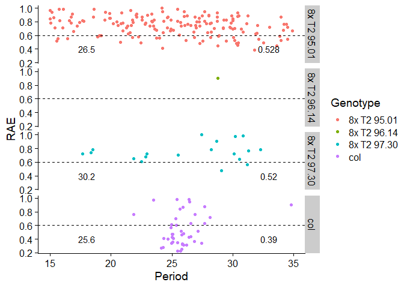

```r
library(tidyverse)
library(cowplot)
theme_set(theme_cowplot())
```

**Load the data** 

```r
Dull560_luc <- read_csv("Dull 560_All_Results.csv")
```

```
## Parsed with column specification:
## cols(
##   .default = col_double(),
##   Genotype = col_character(),
##   `12` = col_logical(),
##   `14` = col_logical(),
##   `16` = col_logical(),
##   `18` = col_logical(),
##   `20` = col_logical(),
##   `22` = col_logical(),
##   `24` = col_logical(),
##   `26` = col_logical(),
##   `28` = col_logical(),
##   `30` = col_logical(),
##   `32` = col_logical(),
##   `34` = col_logical()
## )
```

```
## See spec(...) for full column specifications.
```

```r
head(Dull560_luc)
```

```
## # A tibble: 6 x 89
##   Region Genotype Period Amplitude  Phase   RAE `12`  `14`  `16`  `18`  `20` 
##    <dbl> <chr>     <dbl>     <dbl>  <dbl> <dbl> <lgl> <lgl> <lgl> <lgl> <lgl>
## 1    119 col        25.5     1087   10.4   0.23 NA    NA    NA    NA    NA   
## 2    325 col        25.7      748.  11.5   0.23 NA    NA    NA    NA    NA   
## 3    167 col        25.8     1355    9.56  0.25 NA    NA    NA    NA    NA   
## 4     73 col        24.1     1853    7.49  0.27 NA    NA    NA    NA    NA   
## 5    320 col        24.3     1224    9.2   0.28 NA    NA    NA    NA    NA   
## 6     71 col        26.0      896. -12.7   0.31 NA    NA    NA    NA    NA   
## # ... with 78 more variables: `22` <lgl>, `24` <lgl>, `26` <lgl>, `28` <lgl>,
## #   `30` <lgl>, `32` <lgl>, `34` <lgl>, `36` <dbl>, `38` <dbl>, `40` <dbl>,
## #   `42` <dbl>, `44` <dbl>, `46` <dbl>, `48` <dbl>, `50` <dbl>, `52` <dbl>,
## #   `54` <dbl>, `56` <dbl>, `58` <dbl>, `60` <dbl>, `62` <dbl>, `64` <dbl>,
## #   `66` <dbl>, `68` <dbl>, `70` <dbl>, `72` <dbl>, `74` <dbl>, `76` <dbl>,
## #   `78` <dbl>, `80` <dbl>, `82` <dbl>, `84` <dbl>, `86` <dbl>, `88` <dbl>,
## #   `90` <dbl>, `92` <dbl>, `94` <dbl>, `96` <dbl>, `98` <dbl>, `100` <dbl>,
## #   `102` <dbl>, `104` <dbl>, `106` <dbl>, `108` <dbl>, `110` <dbl>,
## #   `112` <dbl>, `114` <dbl>, `116` <dbl>, `118` <dbl>, `120` <dbl>,
## #   `122` <dbl>, `124` <dbl>, `126` <dbl>, `128` <dbl>, `130` <dbl>,
## #   `132` <dbl>, `134` <dbl>, `136` <dbl>, `138` <dbl>, `140` <dbl>,
## #   `142` <dbl>, `144` <dbl>, `146` <dbl>, `148` <dbl>, `150` <dbl>,
## #   `152` <dbl>, `154` <dbl>, `156` <dbl>, `158` <dbl>, `160` <dbl>,
## #   `162` <dbl>, `164` <dbl>, `166` <dbl>, `168` <dbl>, `170` <dbl>,
## #   `172` <dbl>, `174` <dbl>, `176` <dbl>
```

**Look at circadian metrics only** 

```r
brass_output <- Dull560_luc %>% select(Region:RAE)
summary(brass_output)
```

```
##      Region         Genotype             Period        Amplitude      
##  Min.   :  1.00   Length:228         Min.   :15.00   Min.   :  157.3  
##  1st Qu.: 74.75   Class :character   1st Qu.:22.21   1st Qu.: 2741.8  
##  Median :159.00   Mode  :character   Median :25.73   Median : 7806.0  
##  Mean   :157.64                      Mean   :25.31   Mean   : 8992.2  
##  3rd Qu.:237.50                      3rd Qu.:28.75   3rd Qu.:12997.5  
##  Max.   :326.00                      Max.   :34.93   Max.   :34170.0  
##      Phase               RAE        
##  Min.   :-16.1100   Min.   :0.2300  
##  1st Qu.: -5.5225   1st Qu.:0.5775  
##  Median :  0.0650   Median :0.7400  
##  Mean   :  0.3175   Mean   :0.7035  
##  3rd Qu.:  7.2475   3rd Qu.:0.8400  
##  Max.   : 14.8800   Max.   :1.0000
```

**Period and RAE graph**  

```r
# filter for plants with RAE <= 0.6
rhythmic <- brass_output %>% filter(RAE <= 0.6)
summary(rhythmic)
```

```
##      Region        Genotype             Period        Amplitude      
##  Min.   :  5.0   Length:65          Min.   :15.54   Min.   :  249.9  
##  1st Qu.: 69.0   Class :character   1st Qu.:24.70   1st Qu.:  613.0  
##  Median :135.0   Mode  :character   Median :25.84   Median : 7349.0  
##  Mean   :151.7                      Mean   :26.18   Mean   : 9240.6  
##  3rd Qu.:229.0                      3rd Qu.:28.84   3rd Qu.:16290.0  
##  Max.   :326.0                      Max.   :34.52   Max.   :34170.0  
##      Phase              RAE        
##  Min.   :-16.110   Min.   :0.2300  
##  1st Qu.: -5.150   1st Qu.:0.4100  
##  Median :  3.690   Median :0.4800  
##  Mean   :  1.583   Mean   :0.4665  
##  3rd Qu.:  9.560   3rd Qu.:0.5500  
##  Max.   : 13.040   Max.   :0.6000
```

```r
# calculate mean period per genotype
mean_per <- rhythmic %>% group_by(Genotype) %>% 
  summarise(mean(Period), mean(RAE))
mean_per
```

```
## # A tibble: 3 x 3
##   Genotype    `mean(Period)` `mean(RAE)`
##   <chr>                <dbl>       <dbl>
## 1 8x T2 95.01           26.5       0.528
## 2 8x T2 97.30           30.2       0.52 
## 3 col                   25.6       0.390
```

```r
colnames(mean_per) <- c("Genotype", "per", "rae")
# round numbers 
mean_per <- mean_per %>% mutate(
  per_round = signif(per, 3),
  rae_round = signif(rae, 3)
)

ggplot(brass_output) + 
  geom_point(aes(Period, RAE, color = Genotype)) + 
  facet_grid(Genotype ~ .) + 
  geom_hline(aes(yintercept = 0.6), linetype = "dashed") + 
  geom_text(data = mean_per, aes(x = 18, y = 0.4, label = per_round), color = "black") + 
  geom_text(data = mean_per, aes(x = 33, y = 0.4, label = rae_round), color = "black")
```

<!-- -->

**Luminescence vs Time Graph**    

```r
# format data
trace <- Dull560_luc %>% select(-c(`12`:`34`))
head(trace)
```

```
## # A tibble: 6 x 77
##   Region Genotype Period Amplitude  Phase   RAE   `36`   `38`   `40`   `42`
##    <dbl> <chr>     <dbl>     <dbl>  <dbl> <dbl>  <dbl>  <dbl>  <dbl>  <dbl>
## 1    119 col        25.5     1087   10.4   0.23 6.77e4 6.78e4 6.85e4 6.86e4
## 2    325 col        25.7      748.  11.5   0.23 6.64e4 6.71e4 6.76e4 6.80e4
## 3    167 col        25.8     1355    9.56  0.25 9.08e4 9.31e4 9.18e4 9.21e4
## 4     73 col        24.1     1853    7.49  0.27 1.12e5 1.12e5 1.12e5 1.13e5
## 5    320 col        24.3     1224    9.2   0.28 8.97e4 8.98e4 9.08e4 9.15e4
## 6     71 col        26.0      896. -12.7   0.31 9.89e4 9.76e4 9.89e4 9.86e4
## # ... with 67 more variables: `44` <dbl>, `46` <dbl>, `48` <dbl>, `50` <dbl>,
## #   `52` <dbl>, `54` <dbl>, `56` <dbl>, `58` <dbl>, `60` <dbl>, `62` <dbl>,
## #   `64` <dbl>, `66` <dbl>, `68` <dbl>, `70` <dbl>, `72` <dbl>, `74` <dbl>,
## #   `76` <dbl>, `78` <dbl>, `80` <dbl>, `82` <dbl>, `84` <dbl>, `86` <dbl>,
## #   `88` <dbl>, `90` <dbl>, `92` <dbl>, `94` <dbl>, `96` <dbl>, `98` <dbl>,
## #   `100` <dbl>, `102` <dbl>, `104` <dbl>, `106` <dbl>, `108` <dbl>,
## #   `110` <dbl>, `112` <dbl>, `114` <dbl>, `116` <dbl>, `118` <dbl>,
## #   `120` <dbl>, `122` <dbl>, `124` <dbl>, `126` <dbl>, `128` <dbl>,
## #   `130` <dbl>, `132` <dbl>, `134` <dbl>, `136` <dbl>, `138` <dbl>,
## #   `140` <dbl>, `142` <dbl>, `144` <dbl>, `146` <dbl>, `148` <dbl>,
## #   `150` <dbl>, `152` <dbl>, `154` <dbl>, `156` <dbl>, `158` <dbl>,
## #   `160` <dbl>, `162` <dbl>, `164` <dbl>, `166` <dbl>, `168` <dbl>,
## #   `170` <dbl>, `172` <dbl>, `174` <dbl>, `176` <dbl>
```

```r
trace <- trace %>% 
  pivot_longer(c(`36`:`176`), names_to = "ZT", values_to = "lum") %>% 
  mutate(
    Region = as.factor(Region),
    Genotype = as.factor(Genotype),
    ZT = as.numeric(ZT)
  )
```


```r
# avg lum by gt * zt
lum_avg <- trace %>% group_by(Genotype, ZT) %>% 
  summarise(avg_lum = mean(lum))
head(lum_avg)
```

```
## # A tibble: 6 x 3
## # Groups:   Genotype [1]
##   Genotype       ZT avg_lum
##   <fct>       <dbl>   <dbl>
## 1 8x T2 95.01    36 439930.
## 2 8x T2 95.01    38 434497.
## 3 8x T2 95.01    40 440297.
## 4 8x T2 95.01    42 449409.
## 5 8x T2 95.01    44 455283.
## 6 8x T2 95.01    46 453961.
```


```r
# background subtraction 
min(lum_avg$avg_lum)
```

```
## [1] 78258.4
```

```r
bg = 78000

lum_avg <- lum_avg %>% mutate(
  bg_sub = avg_lum - bg
)
```


```r
# scale luminescence 

# grouped 
lum_avg <- lum_avg %>%
  group_by(Genotype) %>% 
  mutate(
    scale_lum = bg_sub / max(bg_sub)
  )

lum_avg %>% group_by(Genotype) %>% summarise(min_lum = min(scale_lum))
```

```
## # A tibble: 4 x 2
##   Genotype    min_lum
##   <fct>         <dbl>
## 1 8x T2 95.01   0.945
## 2 8x T2 96.14   0.705
## 3 8x T2 97.30   0.912
## 4 col           0.138
```

```r
# seems to be different per genotype
```


```r
# graph using grouped method 
lum_avg %>% 
  ggplot(aes(ZT, scale_lum, color = Genotype)) +
  geom_point() +
  geom_line() + 
  labs(title = "8X T2 LUC assay",
       subtitle = "Dull 560") + 
  ylab("Scaled Luminescence")
```

<!-- -->

```r
# ugh, way faster than my previous loop method 
```


```r
# scale luminescence 

# looped 
lum_loop <- lum_avg %>% 
  select(-scale_lum) %>% 
  mutate(max_lum = NA)

for (i in 1:nrow(lum_loop)) {
  select <- filter(lum_loop, Genotype == lum_loop$Genotype[[i]])
  lum_loop$max_lum[[i]] <- max(select$bg_sub)
}

head(lum_loop)
```

```
## # A tibble: 6 x 5
## # Groups:   Genotype [1]
##   Genotype       ZT avg_lum  bg_sub max_lum
##   <fct>       <dbl>   <dbl>   <dbl>   <dbl>
## 1 8x T2 95.01    36 439930. 361930. 377283.
## 2 8x T2 95.01    38 434497. 356497. 377283.
## 3 8x T2 95.01    40 440297. 362297. 377283.
## 4 8x T2 95.01    42 449409. 371409. 377283.
## 5 8x T2 95.01    44 455283. 377283. 377283.
## 6 8x T2 95.01    46 453961. 375961. 377283.
```

```r
lum_loop <- lum_loop %>% 
  mutate(
    scale_lum = bg_sub / max_lum
  )

lum_loop %>% group_by(Genotype) %>% summarise(min_lum = min(scale_lum))
```

```
## # A tibble: 4 x 2
##   Genotype    min_lum
##   <fct>         <dbl>
## 1 8x T2 95.01   0.945
## 2 8x T2 96.14   0.705
## 3 8x T2 97.30   0.912
## 4 col           0.138
```


```r
# graph using looped method 
lum_loop %>% 
  ggplot(aes(ZT, scale_lum, color = Genotype)) +
  geom_point() +
  geom_line() + 
  labs(title = "8X T2 LUC assay",
       subtitle = "Dull 560") + 
  ylab("Scaled Luminescence")
```

<!-- -->


```r
se <- function(x) {
  sd(x) / sqrt(length(x))
}

# standard error of gt * zt
lum_error <- trace %>% group_by(Genotype, ZT) %>% 
  summarise(
    avg_lum = mean(lum),
    se_lum = se(lum)
  )
head(lum_error)
```

```
## # A tibble: 6 x 4
## # Groups:   Genotype [1]
##   Genotype       ZT avg_lum se_lum
##   <fct>       <dbl>   <dbl>  <dbl>
## 1 8x T2 95.01    36 439930. 13845.
## 2 8x T2 95.01    38 434497. 13761.
## 3 8x T2 95.01    40 440297. 14051.
## 4 8x T2 95.01    42 449409. 14469.
## 5 8x T2 95.01    44 455283. 14833.
## 6 8x T2 95.01    46 453961. 14648.
```


```r
# what does this look like without scaling? 
lum_error %>% 
  ggplot(aes(ZT, avg_lum, color = Genotype)) +
  geom_point() +
  geom_line() + 
  geom_errorbar(aes(ymin = avg_lum - se_lum, ymax = avg_lum + se_lum), width = 0.1, size = 0.8) + 
  labs(title = "8X T2 LUC assay",
       subtitle = "Dull 560") + 
  ylab("Luminescence")
```

<!-- -->

