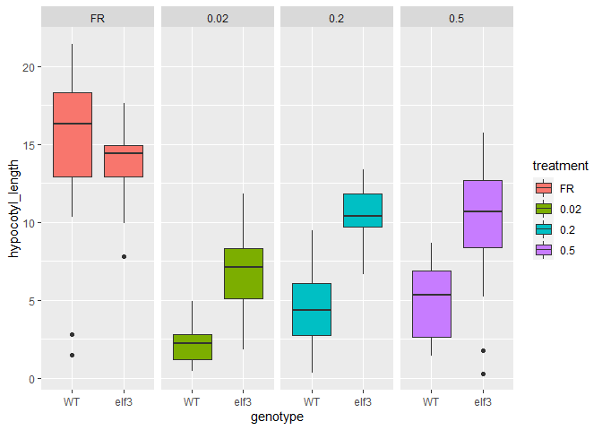

```r
library(tidyverse)
library(cowplot) 
theme_set(theme_cowplot())
```

## Check out Data 


```r
hyp <- read_csv("hypocotyl_elongation_data_rclub.csv")
```

```
## Warning: Missing column names filled in: 'X12' [12]
```

```
## Parsed with column specification:
## cols(
##   number = col_double(),
##   genotype = col_character(),
##   treatment = col_character(),
##   DAG = col_double(),
##   hypocotyl_length = col_double(),
##   hypcotyl_pixels = col_double(),
##   cm_pixels = col_double(),
##   first_internode_length = col_double(),
##   first_internode_pixels = col_double(),
##   germination_notes = col_character(),
##   `image used` = col_character(),
##   X12 = col_logical()
## )
```

```r
# remove extra column
hyp <- hyp %>% select(-X12)
summary(hyp)
```

```
##      number         genotype          treatment              DAG    
##  Min.   :  1.00   Length:196         Length:196         Min.   :10  
##  1st Qu.: 37.75   Class :character   Class :character   1st Qu.:10  
##  Median : 74.50   Mode  :character   Mode  :character   Median :10  
##  Mean   : 74.50                                         Mean   :10  
##  3rd Qu.:111.25                                         3rd Qu.:10  
##  Max.   :148.00                                         Max.   :10  
##  NA's   :48                                             NA's   :48  
##  hypocotyl_length  hypcotyl_pixels     cm_pixels     first_internode_length
##  Min.   : 0.2836   Min.   :  55.59   Min.   :128.0   Min.   :0.000         
##  1st Qu.: 4.0723   1st Qu.: 805.22   1st Qu.:172.0   1st Qu.:1.123         
##  Median : 8.0600   Median :1587.22   Median :187.5   Median :2.082         
##  Mean   : 8.3922   Mean   :1520.82   Mean   :189.8   Mean   :2.481         
##  3rd Qu.:12.3922   3rd Qu.:2236.67   3rd Qu.:208.3   3rd Qu.:3.868         
##  Max.   :21.4196   Max.   :3180.85   Max.   :246.1   Max.   :7.084         
##  NA's   :48        NA's   :48        NA's   :48      NA's   :48            
##  first_internode_pixels germination_notes   image used       
##  Min.   :   0.0         Length:196         Length:196        
##  1st Qu.: 193.5         Class :character   Class :character  
##  Median : 429.0         Mode  :character   Mode  :character  
##  Mean   : 474.0                                              
##  3rd Qu.: 706.8                                              
##  Max.   :1353.0                                              
##  NA's   :48
```

```r
# set factors
hyp <- hyp %>% 
  rename(image_used = `image used`) %>% 
  mutate(
    genotype = as_factor(genotype),
    treatment = as_factor(treatment),
    image_used = as_factor(image_used)
)

# too many rows for some reason 
hyp <- hyp %>% 
  filter(number != "NA")

summary(hyp)
```

```
##      number       genotype  treatment      DAG     hypocotyl_length 
##  Min.   :  1.00   WT  :66   FR  :34   Min.   :10   Min.   : 0.2836  
##  1st Qu.: 37.75   elf3:82   0.02:39   1st Qu.:10   1st Qu.: 4.0723  
##  Median : 74.50             0.2 :39   Median :10   Median : 8.0600  
##  Mean   : 74.50             0.5 :36   Mean   :10   Mean   : 8.3922  
##  3rd Qu.:111.25                       3rd Qu.:10   3rd Qu.:12.3922  
##  Max.   :148.00                       Max.   :10   Max.   :21.4196  
##                                                                     
##  hypcotyl_pixels     cm_pixels     first_internode_length
##  Min.   :  55.59   Min.   :128.0   Min.   :0.000         
##  1st Qu.: 805.22   1st Qu.:172.0   1st Qu.:1.123         
##  Median :1587.22   Median :187.5   Median :2.082         
##  Mean   :1520.82   Mean   :189.8   Mean   :2.481         
##  3rd Qu.:2236.67   3rd Qu.:208.3   3rd Qu.:3.868         
##  Max.   :3180.85   Max.   :246.1   Max.   :7.084         
##                                                          
##  first_internode_pixels germination_notes     image_used 
##  Min.   :   0.0         Length:148         IMG_1515:  3  
##  1st Qu.: 193.5         Class :character   IMG_1517:  3  
##  Median : 429.0         Mode  :character   IMG_1519:  3  
##  Mean   : 474.0                            IMG_1522:  3  
##  3rd Qu.: 706.8                            IMG_1524:  3  
##  Max.   :1353.0                            IMG_1526:  3  
##                                            (Other) :130
```

## Hypocotyl Length Plots


```r
ggplot(hyp, aes(genotype, hypocotyl_length)) + 
  geom_boxplot(aes(fill = treatment)) + 
  facet_grid(. ~ treatment)
```

<!-- -->

## Data Analysis 


```r
model_simple <- lm(hyp$hypocotyl_length ~ hyp$genotype)
summary(model_simple)
```

```
## 
## Call:
## lm(formula = hyp$hypocotyl_length ~ hyp$genotype)
## 
## Residuals:
##      Min       1Q   Median       3Q      Max 
## -10.0110  -3.4435  -0.5807   2.5822  15.3909 
## 
## Coefficients:
##                  Estimate Std. Error t value Pr(>|t|)    
## (Intercept)        6.0287     0.5690   10.60  < 2e-16 ***
## hyp$genotypeelf3   4.2658     0.7644    5.58 1.13e-07 ***
## ---
## Signif. codes:  0 '***' 0.001 '**' 0.01 '*' 0.05 '.' 0.1 ' ' 1
## 
## Residual standard error: 4.623 on 146 degrees of freedom
## Multiple R-squared:  0.1758,	Adjusted R-squared:  0.1702 
## F-statistic: 31.14 on 1 and 146 DF,  p-value: 1.133e-07
```

```r
anova(model_simple)
```

```
## Analysis of Variance Table
## 
## Response: hyp$hypocotyl_length
##               Df  Sum Sq Mean Sq F value    Pr(>F)    
## hyp$genotype   1  665.44  665.44  31.141 1.133e-07 ***
## Residuals    146 3119.79   21.37                      
## ---
## Signif. codes:  0 '***' 0.001 '**' 0.01 '*' 0.05 '.' 0.1 ' ' 1
```

```r
model_noint <- lm(hyp$hypocotyl_length ~ hyp$genotype + hyp$treatment)
summary(model_noint)
```

```
## 
## Call:
## lm(formula = hyp$hypocotyl_length ~ hyp$genotype + hyp$treatment)
## 
## Residuals:
##      Min       1Q   Median       3Q      Max 
## -10.2418  -1.6683   0.0297   1.5545   9.7311 
## 
## Coefficients:
##                   Estimate Std. Error t value Pr(>|t|)    
## (Intercept)        11.6886     0.6503  17.975  < 2e-16 ***
## hyp$genotypeelf3    3.9311     0.5462   7.197 3.20e-11 ***
## hyp$treatment0.02  -9.1428     0.7746 -11.804  < 2e-16 ***
## hyp$treatment0.2   -6.1827     0.7739  -7.989 4.11e-13 ***
## hyp$treatment0.5   -5.9032     0.7883  -7.488 6.58e-12 ***
## ---
## Signif. codes:  0 '***' 0.001 '**' 0.01 '*' 0.05 '.' 0.1 ' ' 1
## 
## Residual standard error: 3.296 on 143 degrees of freedom
## Multiple R-squared:  0.5895,	Adjusted R-squared:  0.578 
## F-statistic: 51.33 on 4 and 143 DF,  p-value: < 2.2e-16
```

```r
anova(model_noint)
```

```
## Analysis of Variance Table
## 
## Response: hyp$hypocotyl_length
##                Df  Sum Sq Mean Sq F value    Pr(>F)    
## hyp$genotype    1  665.44  665.44  61.237 1.024e-12 ***
## hyp$treatment   3 1565.87  521.96  48.033 < 2.2e-16 ***
## Residuals     143 1553.92   10.87                      
## ---
## Signif. codes:  0 '***' 0.001 '**' 0.01 '*' 0.05 '.' 0.1 ' ' 1
```

```r
model_int <- lm(hyp$hypocotyl_length ~ hyp$genotype * hyp$treatment)
summary(model_int)
```

```
## 
## Call:
## lm(formula = hyp$hypocotyl_length ~ hyp$genotype * hyp$treatment)
## 
## Residuals:
##      Min       1Q   Median       3Q      Max 
## -12.8402  -1.3427   0.1474   1.8640   7.1326 
## 
## Coefficients:
##                                    Estimate Std. Error t value Pr(>|t|)    
## (Intercept)                         14.2870     0.8257  17.303  < 2e-16 ***
## hyp$genotypeelf3                    -0.4862     1.0766  -0.452 0.652248    
## hyp$treatment0.02                  -12.0924     1.0882 -11.112  < 2e-16 ***
## hyp$treatment0.2                    -9.9005     1.1010  -8.993 1.52e-15 ***
## hyp$treatment0.5                    -9.1387     1.1481  -7.960 5.31e-13 ***
## hyp$genotypeelf3:hyp$treatment0.02   5.1021     1.4624   3.489 0.000649 ***
## hyp$genotypeelf3:hyp$treatment0.2    6.4962     1.4642   4.437 1.84e-05 ***
## hyp$genotypeelf3:hyp$treatment0.5    5.5095     1.5000   3.673 0.000340 ***
## ---
## Signif. codes:  0 '***' 0.001 '**' 0.01 '*' 0.05 '.' 0.1 ' ' 1
## 
## Residual standard error: 3.09 on 140 degrees of freedom
## Multiple R-squared:  0.647,	Adjusted R-squared:  0.6293 
## F-statistic: 36.65 on 7 and 140 DF,  p-value: < 2.2e-16
```

```r
anova(model_int)
```

```
## Analysis of Variance Table
## 
## Response: hyp$hypocotyl_length
##                             Df  Sum Sq Mean Sq F value    Pr(>F)    
## hyp$genotype                 1  665.44  665.44 69.7140 5.975e-14 ***
## hyp$treatment                3 1565.87  521.96 54.6824 < 2.2e-16 ***
## hyp$genotype:hyp$treatment   3  217.59   72.53  7.5985 9.597e-05 ***
## Residuals                  140 1336.33    9.55                      
## ---
## Signif. codes:  0 '***' 0.001 '**' 0.01 '*' 0.05 '.' 0.1 ' ' 1
```

