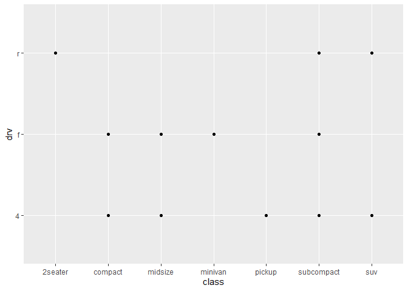
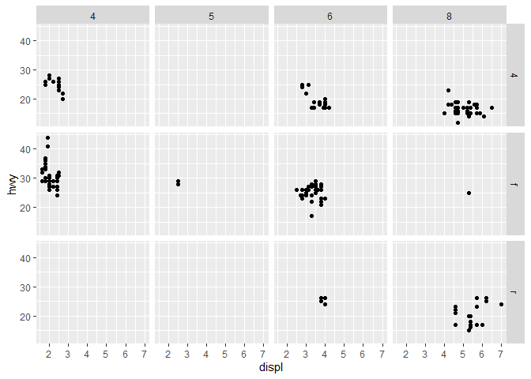
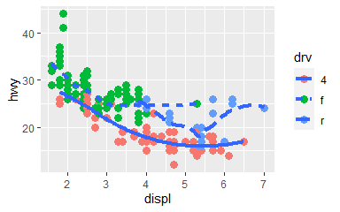

```r
library(tidyverse)
```

## Chapter 1

`dput()` will generate the code required to recreate a dataset.   

```r
dput(mtcars)
```

```
## structure(list(mpg = c(21, 21, 22.8, 21.4, 18.7, 18.1, 14.3, 
## 24.4, 22.8, 19.2, 17.8, 16.4, 17.3, 15.2, 10.4, 10.4, 14.7, 32.4, 
## 30.4, 33.9, 21.5, 15.5, 15.2, 13.3, 19.2, 27.3, 26, 30.4, 15.8, 
## 19.7, 15, 21.4), cyl = c(6, 6, 4, 6, 8, 6, 8, 4, 4, 6, 6, 8, 
## 8, 8, 8, 8, 8, 4, 4, 4, 4, 8, 8, 8, 8, 4, 4, 4, 8, 6, 8, 4), 
##     disp = c(160, 160, 108, 258, 360, 225, 360, 146.7, 140.8, 
##     167.6, 167.6, 275.8, 275.8, 275.8, 472, 460, 440, 78.7, 75.7, 
##     71.1, 120.1, 318, 304, 350, 400, 79, 120.3, 95.1, 351, 145, 
##     301, 121), hp = c(110, 110, 93, 110, 175, 105, 245, 62, 95, 
##     123, 123, 180, 180, 180, 205, 215, 230, 66, 52, 65, 97, 150, 
##     150, 245, 175, 66, 91, 113, 264, 175, 335, 109), drat = c(3.9, 
##     3.9, 3.85, 3.08, 3.15, 2.76, 3.21, 3.69, 3.92, 3.92, 3.92, 
##     3.07, 3.07, 3.07, 2.93, 3, 3.23, 4.08, 4.93, 4.22, 3.7, 2.76, 
##     3.15, 3.73, 3.08, 4.08, 4.43, 3.77, 4.22, 3.62, 3.54, 4.11
##     ), wt = c(2.62, 2.875, 2.32, 3.215, 3.44, 3.46, 3.57, 3.19, 
##     3.15, 3.44, 3.44, 4.07, 3.73, 3.78, 5.25, 5.424, 5.345, 2.2, 
##     1.615, 1.835, 2.465, 3.52, 3.435, 3.84, 3.845, 1.935, 2.14, 
##     1.513, 3.17, 2.77, 3.57, 2.78), qsec = c(16.46, 17.02, 18.61, 
##     19.44, 17.02, 20.22, 15.84, 20, 22.9, 18.3, 18.9, 17.4, 17.6, 
##     18, 17.98, 17.82, 17.42, 19.47, 18.52, 19.9, 20.01, 16.87, 
##     17.3, 15.41, 17.05, 18.9, 16.7, 16.9, 14.5, 15.5, 14.6, 18.6
##     ), vs = c(0, 0, 1, 1, 0, 1, 0, 1, 1, 1, 1, 0, 0, 0, 0, 0, 
##     0, 1, 1, 1, 1, 0, 0, 0, 0, 1, 0, 1, 0, 0, 0, 1), am = c(1, 
##     1, 1, 0, 0, 0, 0, 0, 0, 0, 0, 0, 0, 0, 0, 0, 0, 1, 1, 1, 
##     0, 0, 0, 0, 0, 1, 1, 1, 1, 1, 1, 1), gear = c(4, 4, 4, 3, 
##     3, 3, 3, 4, 4, 4, 4, 3, 3, 3, 3, 3, 3, 4, 4, 4, 3, 3, 3, 
##     3, 3, 4, 5, 5, 5, 5, 5, 4), carb = c(4, 4, 1, 1, 2, 1, 4, 
##     2, 2, 4, 4, 3, 3, 3, 4, 4, 4, 1, 2, 1, 1, 2, 2, 4, 2, 1, 
##     2, 2, 4, 6, 8, 2)), row.names = c("Mazda RX4", "Mazda RX4 Wag", 
## "Datsun 710", "Hornet 4 Drive", "Hornet Sportabout", "Valiant", 
## "Duster 360", "Merc 240D", "Merc 230", "Merc 280", "Merc 280C", 
## "Merc 450SE", "Merc 450SL", "Merc 450SLC", "Cadillac Fleetwood", 
## "Lincoln Continental", "Chrysler Imperial", "Fiat 128", "Honda Civic", 
## "Toyota Corolla", "Toyota Corona", "Dodge Challenger", "AMC Javelin", 
## "Camaro Z28", "Pontiac Firebird", "Fiat X1-9", "Porsche 914-2", 
## "Lotus Europa", "Ford Pantera L", "Ferrari Dino", "Maserati Bora", 
## "Volvo 142E"), class = "data.frame")
```

## Chapter 3 

### Exercises 

#### 3.2.4   

1. Run `ggplot(data = mpg)`. What do you see?  

```r
ggplot(data = mpg)
```

<!-- -->

   This seems to make an empty graph space.  

2. How many rows are in `mpg`? How many columns?  

```r
dim(mpg)
```

```
## [1] 234  11
```

3. What does the `drv` variable describe? Read the help for `?mpg` to find out.   
  `drv` describes drive train with three categories: front-wheel drive, rear-wheel drive, and four-wheel drive.    

4. Make a scatterplot of `hwy` vs `cyl`.   

```r
ggplot(mpg) + 
  geom_point(aes(hwy, cyl))
```

<!-- -->

5. What happens if you make a scatterplot of `class` vs `drv`? Why is the plot not useful?   

```r
ggplot(mpg) + 
  geom_point(aes(class, drv))
```

<!-- -->
  
  These are both categorical variables, so points are only plotted at the intersections of two categories. This is not useful because all of the points are stacking directly on top of each other.   

#### 3.3.1

1. What's gone wrong with this code? Why are the points not blue?  

```r
ggplot(mpg) + 
  geom_point(aes(displ, hwy, color = "blue"))
```

<!-- -->

  The `color` assignment is within the `aes` settings, so R is looking for a "blue" variable to map to color.  

2. Which variables in mpg are categorical? Which variables are continuous? (Hint: type `?mpg` to read the documentation for the dataset). How can you see this information when you run `mpg`?    

  Categorical 

  * Manufacturer   
  * Model   
  * Cyl   
  * Trans   
  * Drv   
  * Fl   
  * Class    

  Continuous    

  * Displ   
  * Cty    
  * Hwy    

```r
head(mpg)
```

```
## # A tibble: 6 x 11
##   manufacturer model displ  year   cyl trans      drv     cty   hwy fl    class 
##   <chr>        <chr> <dbl> <int> <int> <chr>      <chr> <int> <int> <chr> <chr> 
## 1 audi         a4      1.8  1999     4 auto(l5)   f        18    29 p     compa~
## 2 audi         a4      1.8  1999     4 manual(m5) f        21    29 p     compa~
## 3 audi         a4      2    2008     4 manual(m6) f        20    31 p     compa~
## 4 audi         a4      2    2008     4 auto(av)   f        21    30 p     compa~
## 5 audi         a4      2.8  1999     6 auto(l5)   f        16    26 p     compa~
## 6 audi         a4      2.8  1999     6 manual(m5) f        18    26 p     compa~
```
 Looks like you can generally tell by data type, although I would argue that `cyl` is categorical even though R reads it as an integer.   
 
3. Map a continuous variable to `color`, `size`, and `shape`. How do these aesthetics behave differently for categorical vs continuous variables?    

```r
ggplot(mpg) + 
  geom_point(aes(displ, hwy, color = cty, size = cty))
```

<!-- -->

  For categorical variables `color` and `size` are assigned to discrete levels, but they are scaled as gradients for continuous variables. `shape` works for categorical variables but cannot be used for continuous variables.   
  
4. What happens if you map the same variable to multiple aesthetics?    
  Since I did that above, you can see that those aesthetics are all applied to the variable simultaneously.   
  
5. What does the `stroke` aesthetic do? What shapes does it work with? (Hint: use `?geom_point`)   
  Based on `vignette("ggplot2-specs")` it looks like `stroke` controls the size of the black outline of the shape. This only works with shapes 21-24.   
  
6. What happens if you map an aesthetic to something other than a variable name, like `aes(color = displ < 5)`? Note, you'll also need to specify x and y.   

```r
ggplot(mpg) + 
  geom_point(aes(displ, hwy, color = displ < 5))
```

<!-- -->

  R will map the aesthetic based on the evaluation of the statement.   

#### 3.5.1 

1. What happens if you facet on a continuous variable?   

```r
ggplot(mpg) + 
  geom_point(aes(cty, hwy)) + 
  facet_wrap(~ displ)
```

<!-- -->

  Looks like R makes facets for every value of a continuous variable.   
  
2. What do the empty cells in plot with `facet_grid(drv ~ cyl)` mean? How do they relate to this plot?  

```r
ggplot(mpg) + 
  geom_point(aes(drv, cyl))
```

<!-- -->


```r
ggplot(mpg) + 
  geom_point(aes(displ, hwy)) + 
  facet_grid(drv ~ cyl)
```

<!-- -->

  Empty cells are places that don't contain an intersection of points between `drv` and `cyl`, as seen in the initial scatterplot.  
  
3. What plots does the following code make? What does `.` do?    

```r
# displ by hwy, rows of drv facets
ggplot(mpg) + 
  geom_point(aes(displ, hwy)) + 
  facet_grid(drv ~ .)
```

<!-- -->

```r
# displ by hwy, columns of cyl facets
ggplot(mpg) + 
  geom_point(aes(displ, hwy)) + 
  facet_grid(. ~ cyl)
```

<!-- -->

  The `.` in `facet_grid()` serves as a placeholder to leave out facets in either the rows or columns. This essentially turns `facet_grid()` into `facet_wrap()` with a set orientation.   
  
4. Take the first faceted plot in this section:   

```r
ggplot(mpg) + 
  geom_point(aes(displ, hwy)) + 
  facet_wrap(~ class, nrow = 2)
```

<!-- -->

What are the advantages to using faceting instead of the color aesthetic? What are the disadvantages? How might the balance change if you had a larger dataset.  

  The advantage of faceting is that each faceted group is separated onto its own plot so it's easier to look for trends within groups. The disadvantage of faceting is that each faceted group is separated onto its own plot so it's more difficult to directly compare values between groups. Faceting is probably more helpful with a larger dataset, where you're more likely to have an unintelligible blob of colored points all overlapping with each other.  
  
5. Read `?facet_wrap`. What does `nrow` do? What does `ncol` do? What other options control the layout of the individual panels? Why doesn't `facet_grid()` have `nrow` and `ncol` arguments?     

  The number of facet rows is controlled by `nrow` and the number of facet columns is controlled by `ncol`. To swap which facet contains the highest values, use `as.table`. There aren't `nrow` and `ncol` arguments for `facet_grid()` because the number of rows and columns are determined by the number of levels of the variable assigned to that dimension.     
  
6. When using `facet_grid()` you should usually put the variable with more unique levels in the columns. Why?    

```r
ggplot(mpg) + 
  geom_point(aes(displ, hwy)) + 
  facet_grid(cyl ~ class)
```

<!-- -->

```r
ggplot(mpg) + 
  geom_point(aes(displ, hwy)) + 
  facet_grid(class ~ cyl)
```

<!-- -->

  By default R plots are wider than they are tall, so having more unique levels in the columns gives those levels more space than if they were assigned to rows.     

#### 3.6.1 

1. What geom would you use to draw a line chart? A boxplot? A histogram? An area chart?    

  * Line chart: `geom_line()`   
  * Boxplot: `geom_boxplot()`    
  * Histogram: `geom_histogram()`   
  * Area chart: `geom_area()`    

2. Run this code in your head and predict what the output will look like. Then, run the code in R and check the predictions.    
```
ggplot(mpg, aes(displ, hwy, color = drv)) + 
  geom_point() + 
  geom_smooth(se = FALSE)
```

  The above code will produce a plot with `displ` on the x-axis and `hwy` on the y-axis that is colored by the `drv` variable. All data will be plotted as points, colored by `drv`, and there will be three trend lines without confidence interval shading corresponding to and colored by `drv`.   

```r
ggplot(mpg, aes(displ, hwy, color = drv)) + 
  geom_point() + 
  geom_smooth(se = FALSE)
```

```
## `geom_smooth()` using method = 'loess' and formula 'y ~ x'
```

<!-- -->

3. What does `show.legend = FALSE` do? What happens if you remove it? Why do you think I used it earlier in the chapter?    
  With `show.legend = FALSE`, the legend for aesthetic mappings will be missing. If you remove it, you would see a legend of aesthetic values. It was probably used earlier in the chapter to keep all the graphs the same size and more cleanly demonstrate how aesthetics group the same as `group` does.   
  
4. What does the `se` argument to `geom_smooth()` do?    
  The `se` argument determines whether or not the confidence interval is shaded around the trend line. This is set to `TRUE` by default, so there will be confidence interval shading by default.    
  
5. Will these two graphs look different? Why/why not?    
```
ggplot(mpg, aes(displ, hwy)) + 
  geom_point() + 
  geom_smooth() 
  
ggplot() + 
  geom_point(mpg, aes(displ, hwy)) + 
  geom_smooth(mpg, aes(displ, hwy))
```

  These two graphs will look the same because they have the same `geom` layers and mapping specifications. The first one is just more efficient because it sets aesthetics in the `ggplot()` call instead of separately setting the same aesthetics in each `geom` layer.    
  
6. Recreate the R code necessary to generate the following graphs.    

```r
# left 
ggplot(mpg, aes(displ, hwy)) + 
  geom_point(size = 3) + 
  geom_smooth(se = FALSE, size = 1.5)
```

```
## `geom_smooth()` using method = 'loess' and formula 'y ~ x'
```

```r
# right 
ggplot(mpg, aes(displ, hwy)) + 
  geom_point(size = 3) + 
  geom_smooth(aes(group = drv), se = FALSE, size = 1.5)
```

```
## `geom_smooth()` using method = 'loess' and formula 'y ~ x'
```


```r
# left
ggplot(mpg, aes(displ, hwy, color = drv)) + 
  geom_point(size = 3) + 
  geom_smooth(se = FALSE, size = 1.5)
```

```
## `geom_smooth()` using method = 'loess' and formula 'y ~ x'
```

```r
# right 
ggplot(mpg, aes(displ, hwy)) + 
  geom_point(aes(color = drv), size = 3) + 
  geom_smooth(se = FALSE, size = 1.5)
```

```
## `geom_smooth()` using method = 'loess' and formula 'y ~ x'
```


```r
# left 
ggplot(mpg, aes(displ, hwy)) + 
  geom_point(aes(color = drv), size = 3) + 
  geom_smooth(aes(linetype = drv), se = FALSE, size = 1.5)
```

```
## `geom_smooth()` using method = 'loess' and formula 'y ~ x'
```

```r
# right 
ggplot(mpg, aes(displ, hwy)) + 
  geom_point(color = "white", size = 6) + 
  geom_point(aes(color = drv), size = 3)
```



