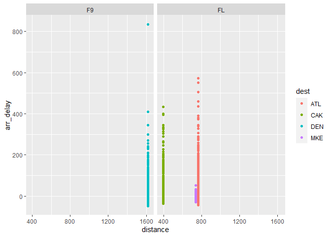

```r
library(tidyverse)
library(nycflights13)
```

## Chapter 4

### Exercises

#### 4.4

**1. Why does this code not work?**    
```
my_variable <- 10
my_varıable
```

The second line has another character in place of the "i".   

**2. Tweak each of the following R commands so that they run correctly:**   
```
ggplot(dota = mpg) + 
  geom_point(mapping = aes(x = displ, y = hwy))

fliter(mpg, cyl = 8)
filter(diamond, carat > 3)
```

```r
# dota to data 
ggplot(data = mpg) + 
  geom_point(mapping = aes(x = displ, y = hwy))
```

<!-- -->

```r
# fliter to filter, = to ==
filter(mpg, cyl == 8)
```

```
## # A tibble: 70 x 11
##    manufacturer model     displ  year   cyl trans  drv     cty   hwy fl    class
##    <chr>        <chr>     <dbl> <int> <int> <chr>  <chr> <int> <int> <chr> <chr>
##  1 audi         a6 quatt~   4.2  2008     8 auto(~ 4        16    23 p     mids~
##  2 chevrolet    c1500 su~   5.3  2008     8 auto(~ r        14    20 r     suv  
##  3 chevrolet    c1500 su~   5.3  2008     8 auto(~ r        11    15 e     suv  
##  4 chevrolet    c1500 su~   5.3  2008     8 auto(~ r        14    20 r     suv  
##  5 chevrolet    c1500 su~   5.7  1999     8 auto(~ r        13    17 r     suv  
##  6 chevrolet    c1500 su~   6    2008     8 auto(~ r        12    17 r     suv  
##  7 chevrolet    corvette    5.7  1999     8 manua~ r        16    26 p     2sea~
##  8 chevrolet    corvette    5.7  1999     8 auto(~ r        15    23 p     2sea~
##  9 chevrolet    corvette    6.2  2008     8 manua~ r        16    26 p     2sea~
## 10 chevrolet    corvette    6.2  2008     8 auto(~ r        15    25 p     2sea~
## # ... with 60 more rows
```

```r
# diamond to diamonds
filter(diamonds, carat > 3)
```

```
## # A tibble: 32 x 10
##    carat cut     color clarity depth table price     x     y     z
##    <dbl> <ord>   <ord> <ord>   <dbl> <dbl> <int> <dbl> <dbl> <dbl>
##  1  3.01 Premium I     I1       62.7    58  8040  9.1   8.97  5.67
##  2  3.11 Fair    J     I1       65.9    57  9823  9.15  9.02  5.98
##  3  3.01 Premium F     I1       62.2    56  9925  9.24  9.13  5.73
##  4  3.05 Premium E     I1       60.9    58 10453  9.26  9.25  5.66
##  5  3.02 Fair    I     I1       65.2    56 10577  9.11  9.02  5.91
##  6  3.01 Fair    H     I1       56.1    62 10761  9.54  9.38  5.31
##  7  3.65 Fair    H     I1       67.1    53 11668  9.53  9.48  6.38
##  8  3.24 Premium H     I1       62.1    58 12300  9.44  9.4   5.85
##  9  3.22 Ideal   I     I1       62.6    55 12545  9.49  9.42  5.92
## 10  3.5  Ideal   H     I1       62.8    57 12587  9.65  9.59  6.03
## # ... with 22 more rows
```

**3. Press `Alt` + `Shift` + `K`. What happens? How can you get to the same place using the menus?**    
This brings up a cool list of keyboard shortcuts for R. You can access this using the menus by clicking `Help` and `Keyboard Shortcuts Help`.   

## Chapter 5 

### Exercises 

#### 5.2.4

**1. Find all flights that**   
  
**1.1 Had an arrival delay of two or more hours**    

```r
filter(flights, arr_delay >= 120) %>% 
  ggplot() + 
  geom_histogram(aes(arr_delay)) + 
  xlim(0, 500)
```

```
## `stat_bin()` using `bins = 30`. Pick better value with `binwidth`.
```

```
## Warning: Removed 51 rows containing non-finite values (stat_bin).
```

```
## Warning: Removed 2 rows containing missing values (geom_bar).
```

<!-- -->

**1.4 Departed in summer (July, August, and September)**    

```r
filter(flights, month %in% c(7:9)) %>% 
  ggplot() + 
  geom_histogram(aes(month))
```

```
## `stat_bin()` using `bins = 30`. Pick better value with `binwidth`.
```

<!-- -->

**1.5 Arrived more than two hours late, but didn't leave late**   

```r
filter(flights, arr_delay > 120, dep_delay <= 0) %>% 
  ggplot() + 
  geom_point(aes(arr_delay, dep_delay))
```

<!-- -->

**1.7 Departed between midnight and 6 am (inclusive)**    

```r
filter(flights, dep_time <= 600 | dep_time == 2400) %>% 
  ggplot() + 
  geom_histogram(aes(dep_time))
```

```
## `stat_bin()` using `bins = 30`. Pick better value with `binwidth`.
```

<!-- -->

**2. Another useful `dplyr` filtering helper is `between()`. What does it do? Can you use it to simplify the code needed to answer the previous challenges?**    
`between()` pulls out values equal to or between two boundary values. This could certainly be used for problem 1.4 above.  

```r
filter(flights, between(month, 7, 9)) %>% 
  ggplot() + 
  geom_histogram(aes(month))
```

```
## `stat_bin()` using `bins = 30`. Pick better value with `binwidth`.
```

<!-- -->

**3. How many flights have a missing `dep_time`? What other variables are missing? What might these rows represent?**    

```r
is.na(flights$dep_time) %>% sum()
```

```
## [1] 8255
```

```r
summary(flights)
```

```
##       year          month             day           dep_time    sched_dep_time
##  Min.   :2013   Min.   : 1.000   Min.   : 1.00   Min.   :   1   Min.   : 106  
##  1st Qu.:2013   1st Qu.: 4.000   1st Qu.: 8.00   1st Qu.: 907   1st Qu.: 906  
##  Median :2013   Median : 7.000   Median :16.00   Median :1401   Median :1359  
##  Mean   :2013   Mean   : 6.549   Mean   :15.71   Mean   :1349   Mean   :1344  
##  3rd Qu.:2013   3rd Qu.:10.000   3rd Qu.:23.00   3rd Qu.:1744   3rd Qu.:1729  
##  Max.   :2013   Max.   :12.000   Max.   :31.00   Max.   :2400   Max.   :2359  
##                                                  NA's   :8255                 
##    dep_delay          arr_time    sched_arr_time   arr_delay       
##  Min.   : -43.00   Min.   :   1   Min.   :   1   Min.   : -86.000  
##  1st Qu.:  -5.00   1st Qu.:1104   1st Qu.:1124   1st Qu.: -17.000  
##  Median :  -2.00   Median :1535   Median :1556   Median :  -5.000  
##  Mean   :  12.64   Mean   :1502   Mean   :1536   Mean   :   6.895  
##  3rd Qu.:  11.00   3rd Qu.:1940   3rd Qu.:1945   3rd Qu.:  14.000  
##  Max.   :1301.00   Max.   :2400   Max.   :2359   Max.   :1272.000  
##  NA's   :8255      NA's   :8713                  NA's   :9430      
##    carrier              flight       tailnum             origin         
##  Length:336776      Min.   :   1   Length:336776      Length:336776     
##  Class :character   1st Qu.: 553   Class :character   Class :character  
##  Mode  :character   Median :1496   Mode  :character   Mode  :character  
##                     Mean   :1972                                        
##                     3rd Qu.:3465                                        
##                     Max.   :8500                                        
##                                                                         
##      dest              air_time        distance         hour      
##  Length:336776      Min.   : 20.0   Min.   :  17   Min.   : 1.00  
##  Class :character   1st Qu.: 82.0   1st Qu.: 502   1st Qu.: 9.00  
##  Mode  :character   Median :129.0   Median : 872   Median :13.00  
##                     Mean   :150.7   Mean   :1040   Mean   :13.18  
##                     3rd Qu.:192.0   3rd Qu.:1389   3rd Qu.:17.00  
##                     Max.   :695.0   Max.   :4983   Max.   :23.00  
##                     NA's   :9430                                  
##      minute        time_hour                  
##  Min.   : 0.00   Min.   :2013-01-01 05:00:00  
##  1st Qu.: 8.00   1st Qu.:2013-04-04 13:00:00  
##  Median :29.00   Median :2013-07-03 10:00:00  
##  Mean   :26.23   Mean   :2013-07-03 05:22:54  
##  3rd Qu.:44.00   3rd Qu.:2013-10-01 07:00:00  
##  Max.   :59.00   Max.   :2013-12-31 23:00:00  
## 
```

Looks like `dep_delay`, `arr_time`, `arr_delay`, and `air_time` all have missing values. These rows could be cancelled flights?    

#### 5.3.1

**1. How could you use `arrange()` to sort all missing values to the start? (Hint: use `is.na()`).**   

```r
# if NA, then = 1 --> desc() so NA (1) is on top 
arrange(flights, desc(is.na(dep_time))) %>% head()
```

```
## # A tibble: 6 x 19
##    year month   day dep_time sched_dep_time dep_delay arr_time sched_arr_time
##   <int> <int> <int>    <int>          <int>     <dbl>    <int>          <int>
## 1  2013     1     1       NA           1630        NA       NA           1815
## 2  2013     1     1       NA           1935        NA       NA           2240
## 3  2013     1     1       NA           1500        NA       NA           1825
## 4  2013     1     1       NA            600        NA       NA            901
## 5  2013     1     2       NA           1540        NA       NA           1747
## 6  2013     1     2       NA           1620        NA       NA           1746
## # ... with 11 more variables: arr_delay <dbl>, carrier <chr>, flight <int>,
## #   tailnum <chr>, origin <chr>, dest <chr>, air_time <dbl>, distance <dbl>,
## #   hour <dbl>, minute <dbl>, time_hour <dttm>
```

**2. Sort `flights` to find the most delayed flights. Find the flights that left earliest.**   

```r
# most delayed
arrange(flights, desc(arr_delay)) %>% print(n = 6, width = Inf)
```

```
## # A tibble: 336,776 x 19
##    year month   day dep_time sched_dep_time dep_delay arr_time sched_arr_time
##   <int> <int> <int>    <int>          <int>     <dbl>    <int>          <int>
## 1  2013     1     9      641            900      1301     1242           1530
## 2  2013     6    15     1432           1935      1137     1607           2120
## 3  2013     1    10     1121           1635      1126     1239           1810
## 4  2013     9    20     1139           1845      1014     1457           2210
## 5  2013     7    22      845           1600      1005     1044           1815
## 6  2013     4    10     1100           1900       960     1342           2211
##   arr_delay carrier flight tailnum origin dest  air_time distance  hour minute
##       <dbl> <chr>    <int> <chr>   <chr>  <chr>    <dbl>    <dbl> <dbl>  <dbl>
## 1      1272 HA          51 N384HA  JFK    HNL        640     4983     9      0
## 2      1127 MQ        3535 N504MQ  JFK    CMH         74      483    19     35
## 3      1109 MQ        3695 N517MQ  EWR    ORD        111      719    16     35
## 4      1007 AA         177 N338AA  JFK    SFO        354     2586    18     45
## 5       989 MQ        3075 N665MQ  JFK    CVG         96      589    16      0
## 6       931 DL        2391 N959DL  JFK    TPA        139     1005    19      0
##   time_hour          
##   <dttm>             
## 1 2013-01-09 09:00:00
## 2 2013-06-15 19:00:00
## 3 2013-01-10 16:00:00
## 4 2013-09-20 18:00:00
## 5 2013-07-22 16:00:00
## 6 2013-04-10 19:00:00
## # ... with 336,770 more rows
```

```r
# earliest departure
arrange(flights, dep_delay) %>% head()
```

```
## # A tibble: 6 x 19
##    year month   day dep_time sched_dep_time dep_delay arr_time sched_arr_time
##   <int> <int> <int>    <int>          <int>     <dbl>    <int>          <int>
## 1  2013    12     7     2040           2123       -43       40           2352
## 2  2013     2     3     2022           2055       -33     2240           2338
## 3  2013    11    10     1408           1440       -32     1549           1559
## 4  2013     1    11     1900           1930       -30     2233           2243
## 5  2013     1    29     1703           1730       -27     1947           1957
## 6  2013     8     9      729            755       -26     1002            955
## # ... with 11 more variables: arr_delay <dbl>, carrier <chr>, flight <int>,
## #   tailnum <chr>, origin <chr>, dest <chr>, air_time <dbl>, distance <dbl>,
## #   hour <dbl>, minute <dbl>, time_hour <dttm>
```

**3. Sort `flights` to find the fastest (highest speed) flights.**    

```r
# can sort to find fastest flights in terms of shortest 
arrange(flights, air_time) %>% print(n = 6, width = Inf)
```

```
## # A tibble: 336,776 x 19
##    year month   day dep_time sched_dep_time dep_delay arr_time sched_arr_time
##   <int> <int> <int>    <int>          <int>     <dbl>    <int>          <int>
## 1  2013     1    16     1355           1315        40     1442           1411
## 2  2013     4    13      537            527        10      622            628
## 3  2013    12     6      922            851        31     1021            954
## 4  2013     2     3     2153           2129        24     2247           2224
## 5  2013     2     5     1303           1315       -12     1342           1411
## 6  2013     2    12     2123           2130        -7     2211           2225
##   arr_delay carrier flight tailnum origin dest  air_time distance  hour minute
##       <dbl> <chr>    <int> <chr>   <chr>  <chr>    <dbl>    <dbl> <dbl>  <dbl>
## 1        31 EV        4368 N16911  EWR    BDL         20      116    13     15
## 2        -6 EV        4631 N12167  EWR    BDL         20      116     5     27
## 3        27 EV        4276 N27200  EWR    BDL         21      116     8     51
## 4        23 EV        4619 N13913  EWR    PHL         21       80    21     29
## 5       -29 EV        4368 N13955  EWR    BDL         21      116    13     15
## 6       -14 EV        4619 N12921  EWR    PHL         21       80    21     30
##   time_hour          
##   <dttm>             
## 1 2013-01-16 13:00:00
## 2 2013-04-13 05:00:00
## 3 2013-12-06 08:00:00
## 4 2013-02-03 21:00:00
## 5 2013-02-05 13:00:00
## 6 2013-02-12 21:00:00
## # ... with 336,770 more rows
```

```r
# doesn't seem like any of the existing variables provide information on speed though...
mutate(flights,
       speed = distance / air_time) %>% 
  arrange(desc(speed)) %>% 
  print(n = 6, width = Inf)
```

```
## # A tibble: 336,776 x 20
##    year month   day dep_time sched_dep_time dep_delay arr_time sched_arr_time
##   <int> <int> <int>    <int>          <int>     <dbl>    <int>          <int>
## 1  2013     5    25     1709           1700         9     1923           1937
## 2  2013     7     2     1558           1513        45     1745           1719
## 3  2013     5    13     2040           2025        15     2225           2226
## 4  2013     3    23     1914           1910         4     2045           2043
## 5  2013     1    12     1559           1600        -1     1849           1917
## 6  2013    11    17      650            655        -5     1059           1150
##   arr_delay carrier flight tailnum origin dest  air_time distance  hour minute
##       <dbl> <chr>    <int> <chr>   <chr>  <chr>    <dbl>    <dbl> <dbl>  <dbl>
## 1       -14 DL        1499 N666DN  LGA    ATL         65      762    17      0
## 2        26 EV        4667 N17196  EWR    MSP         93     1008    15     13
## 3        -1 EV        4292 N14568  EWR    GSP         55      594    20     25
## 4         2 EV        3805 N12567  EWR    BNA         70      748    19     10
## 5       -28 DL        1902 N956DL  LGA    PBI        105     1035    16      0
## 6       -51 DL         315 N3768   JFK    SJU        170     1598     6     55
##   time_hour           speed
##   <dttm>              <dbl>
## 1 2013-05-25 17:00:00 11.7 
## 2 2013-07-02 15:00:00 10.8 
## 3 2013-05-13 20:00:00 10.8 
## 4 2013-03-23 19:00:00 10.7 
## 5 2013-01-12 16:00:00  9.86
## 6 2013-11-17 06:00:00  9.4 
## # ... with 336,770 more rows
```

**4. Which flights travelled the farthest? Which travelled the shortest?**     

```r
# farthest distance 
arrange(flights, desc(distance)) %>% print(n = 6, width = Inf)
```

```
## # A tibble: 336,776 x 19
##    year month   day dep_time sched_dep_time dep_delay arr_time sched_arr_time
##   <int> <int> <int>    <int>          <int>     <dbl>    <int>          <int>
## 1  2013     1     1      857            900        -3     1516           1530
## 2  2013     1     2      909            900         9     1525           1530
## 3  2013     1     3      914            900        14     1504           1530
## 4  2013     1     4      900            900         0     1516           1530
## 5  2013     1     5      858            900        -2     1519           1530
## 6  2013     1     6     1019            900        79     1558           1530
##   arr_delay carrier flight tailnum origin dest  air_time distance  hour minute
##       <dbl> <chr>    <int> <chr>   <chr>  <chr>    <dbl>    <dbl> <dbl>  <dbl>
## 1       -14 HA          51 N380HA  JFK    HNL        659     4983     9      0
## 2        -5 HA          51 N380HA  JFK    HNL        638     4983     9      0
## 3       -26 HA          51 N380HA  JFK    HNL        616     4983     9      0
## 4       -14 HA          51 N384HA  JFK    HNL        639     4983     9      0
## 5       -11 HA          51 N381HA  JFK    HNL        635     4983     9      0
## 6        28 HA          51 N385HA  JFK    HNL        611     4983     9      0
##   time_hour          
##   <dttm>             
## 1 2013-01-01 09:00:00
## 2 2013-01-02 09:00:00
## 3 2013-01-03 09:00:00
## 4 2013-01-04 09:00:00
## 5 2013-01-05 09:00:00
## 6 2013-01-06 09:00:00
## # ... with 336,770 more rows
```

```r
# shortest distance
arrange(flights, distance) %>% print(n = 6, width = Inf)
```

```
## # A tibble: 336,776 x 19
##    year month   day dep_time sched_dep_time dep_delay arr_time sched_arr_time
##   <int> <int> <int>    <int>          <int>     <dbl>    <int>          <int>
## 1  2013     7    27       NA            106        NA       NA            245
## 2  2013     1     3     2127           2129        -2     2222           2224
## 3  2013     1     4     1240           1200        40     1333           1306
## 4  2013     1     4     1829           1615       134     1937           1721
## 5  2013     1     4     2128           2129        -1     2218           2224
## 6  2013     1     5     1155           1200        -5     1241           1306
##   arr_delay carrier flight tailnum origin dest  air_time distance  hour minute
##       <dbl> <chr>    <int> <chr>   <chr>  <chr>    <dbl>    <dbl> <dbl>  <dbl>
## 1        NA US        1632 <NA>    EWR    LGA         NA       17     1      6
## 2        -2 EV        3833 N13989  EWR    PHL         30       80    21     29
## 3        27 EV        4193 N14972  EWR    PHL         30       80    12      0
## 4       136 EV        4502 N15983  EWR    PHL         28       80    16     15
## 5        -6 EV        4645 N27962  EWR    PHL         32       80    21     29
## 6       -25 EV        4193 N14902  EWR    PHL         29       80    12      0
##   time_hour          
##   <dttm>             
## 1 2013-07-27 01:00:00
## 2 2013-01-03 21:00:00
## 3 2013-01-04 12:00:00
## 4 2013-01-04 16:00:00
## 5 2013-01-04 21:00:00
## 6 2013-01-05 12:00:00
## # ... with 336,770 more rows
```

#### 5.4.1 

**1. Brainstorm as many ways as possible to select `dep_time`, `dep_delay`, `arr_time`, and `arr_delay` from `flights`.**     

```r
select(flights, dep_time, dep_delay, arr_time, arr_delay) %>% head()
```

```
## # A tibble: 6 x 4
##   dep_time dep_delay arr_time arr_delay
##      <int>     <dbl>    <int>     <dbl>
## 1      517         2      830        11
## 2      533         4      850        20
## 3      542         2      923        33
## 4      544        -1     1004       -18
## 5      554        -6      812       -25
## 6      554        -4      740        12
```

```r
select(flights, dep_time:arr_delay, -contains("sched")) %>% head()
```

```
## # A tibble: 6 x 4
##   dep_time dep_delay arr_time arr_delay
##      <int>     <dbl>    <int>     <dbl>
## 1      517         2      830        11
## 2      533         4      850        20
## 3      542         2      923        33
## 4      544        -1     1004       -18
## 5      554        -6      812       -25
## 6      554        -4      740        12
```

```r
select(flights, contains(c("dep", "arr_")), -contains("sched")) %>% head()
```

```
## # A tibble: 6 x 4
##   dep_time dep_delay arr_time arr_delay
##      <int>     <dbl>    <int>     <dbl>
## 1      517         2      830        11
## 2      533         4      850        20
## 3      542         2      923        33
## 4      544        -1     1004       -18
## 5      554        -6      812       -25
## 6      554        -4      740        12
```

```r
select(flights, starts_with(c("dep", "arr"))) %>% head()
```

```
## # A tibble: 6 x 4
##   dep_time dep_delay arr_time arr_delay
##      <int>     <dbl>    <int>     <dbl>
## 1      517         2      830        11
## 2      533         4      850        20
## 3      542         2      923        33
## 4      544        -1     1004       -18
## 5      554        -6      812       -25
## 6      554        -4      740        12
```

```r
select(flights, ends_with(c("time", "delay")), -starts_with(c("sched", "air"))) %>% head()
```

```
## # A tibble: 6 x 4
##   dep_time arr_time dep_delay arr_delay
##      <int>    <int>     <dbl>     <dbl>
## 1      517      830         2        11
## 2      533      850         4        20
## 3      542      923         2        33
## 4      544     1004        -1       -18
## 5      554      812        -6       -25
## 6      554      740        -4        12
```

```r
select(flights, 4:9, -contains("sched")) %>% head()
```

```
## # A tibble: 6 x 4
##   dep_time dep_delay arr_time arr_delay
##      <int>     <dbl>    <int>     <dbl>
## 1      517         2      830        11
## 2      533         4      850        20
## 3      542         2      923        33
## 4      544        -1     1004       -18
## 5      554        -6      812       -25
## 6      554        -4      740        12
```

```r
select(flights, -(1:3), -(10:19), -5, -8) %>% head()
```

```
## # A tibble: 6 x 4
##   dep_time dep_delay arr_time arr_delay
##      <int>     <dbl>    <int>     <dbl>
## 1      517         2      830        11
## 2      533         4      850        20
## 3      542         2      923        33
## 4      544        -1     1004       -18
## 5      554        -6      812       -25
## 6      554        -4      740        12
```

**2. What happens if you include the name of a variable multiple times in a `select()` call?**    

```r
select(flights, air_time, air_time, distance) %>% head()
```

```
## # A tibble: 6 x 2
##   air_time distance
##      <dbl>    <dbl>
## 1      227     1400
## 2      227     1416
## 3      160     1089
## 4      183     1576
## 5      116      762
## 6      150      719
```

**3. What does the `one_of()` function do? Why might it be helpful in conjunction with this vector?** 

```r
vars <- c("year", "month", "day", "dep_delay", "arr_delay")
select(flights, one_of(vars)) %>% head()
```

```
## # A tibble: 6 x 5
##    year month   day dep_delay arr_delay
##   <int> <int> <int>     <dbl>     <dbl>
## 1  2013     1     1         2        11
## 2  2013     1     1         4        20
## 3  2013     1     1         2        33
## 4  2013     1     1        -1       -18
## 5  2013     1     1        -6       -25
## 6  2013     1     1        -4        12
```

Looks like `one_of()` just selects for the variable names included within the vector. This would be useful if you have many lines of code or graphs working with a specific subset of columns and you wanted to easily change the column subset for all those lines by changing only the initial variable vector. Also, `one_of()` is now replaced by `any_of()` and `all_of()`. 

**mutat4. Does the result of running the following code surprise you? How do the select helpers deal with case by default? How can you change that default?**    

```r
select(flights, contains("TIME"))
```

```
## # A tibble: 336,776 x 6
##    dep_time sched_dep_time arr_time sched_arr_time air_time time_hour          
##       <int>          <int>    <int>          <int>    <dbl> <dttm>             
##  1      517            515      830            819      227 2013-01-01 05:00:00
##  2      533            529      850            830      227 2013-01-01 05:00:00
##  3      542            540      923            850      160 2013-01-01 05:00:00
##  4      544            545     1004           1022      183 2013-01-01 05:00:00
##  5      554            600      812            837      116 2013-01-01 06:00:00
##  6      554            558      740            728      150 2013-01-01 05:00:00
##  7      555            600      913            854      158 2013-01-01 06:00:00
##  8      557            600      709            723       53 2013-01-01 06:00:00
##  9      557            600      838            846      140 2013-01-01 06:00:00
## 10      558            600      753            745      138 2013-01-01 06:00:00
## # ... with 336,766 more rows
```

This result actually does surprise me because R is usually very case-sensitive. Looks like `select` is set to ignore case by default for matching. You can change the default with `ignore.case = FALSE`.    

```r
select(flights, contains("TIME", ignore.case = FALSE))
```

```
## # A tibble: 336,776 x 0
```

#### 5.5.2   

**1. Currently `dep_time` and `sched_dep_time` are convenient to look at, but hard to compute with because they're not really continuous numbers. Convert them to a more convenient representation of number of minutes since midnight.**     

```r
mutate(flights, 
       dep_min = (dep_time %/% 100) * 60 + dep_time %% 100,
       sched_dep_min = (sched_dep_time %/% 100) * 60 + sched_dep_time %% 100
       ) %>% 
  print(n = 6, width = Inf)
```

```
## # A tibble: 336,776 x 21
##    year month   day dep_time sched_dep_time dep_delay arr_time sched_arr_time
##   <int> <int> <int>    <int>          <int>     <dbl>    <int>          <int>
## 1  2013     1     1      517            515         2      830            819
## 2  2013     1     1      533            529         4      850            830
## 3  2013     1     1      542            540         2      923            850
## 4  2013     1     1      544            545        -1     1004           1022
## 5  2013     1     1      554            600        -6      812            837
## 6  2013     1     1      554            558        -4      740            728
##   arr_delay carrier flight tailnum origin dest  air_time distance  hour minute
##       <dbl> <chr>    <int> <chr>   <chr>  <chr>    <dbl>    <dbl> <dbl>  <dbl>
## 1        11 UA        1545 N14228  EWR    IAH        227     1400     5     15
## 2        20 UA        1714 N24211  LGA    IAH        227     1416     5     29
## 3        33 AA        1141 N619AA  JFK    MIA        160     1089     5     40
## 4       -18 B6         725 N804JB  JFK    BQN        183     1576     5     45
## 5       -25 DL         461 N668DN  LGA    ATL        116      762     6      0
## 6        12 UA        1696 N39463  EWR    ORD        150      719     5     58
##   time_hour           dep_min sched_dep_min
##   <dttm>                <dbl>         <dbl>
## 1 2013-01-01 05:00:00     317           315
## 2 2013-01-01 05:00:00     333           329
## 3 2013-01-01 05:00:00     342           340
## 4 2013-01-01 05:00:00     344           345
## 5 2013-01-01 06:00:00     354           360
## 6 2013-01-01 05:00:00     354           358
## # ... with 336,770 more rows
```

**2. Compare `air_time` with `arr_time - dep_time`. What do you expect to see? What do you see? What do you need to do to fix it?**   

```r
select(flights, air_time, arr_time, dep_time) %>% 
  mutate(
    flight_time = arr_time - dep_time
  ) %>% 
  head()
```

```
## # A tibble: 6 x 4
##   air_time arr_time dep_time flight_time
##      <dbl>    <int>    <int>       <int>
## 1      227      830      517         313
## 2      227      850      533         317
## 3      160      923      542         381
## 4      183     1004      544         460
## 5      116      812      554         258
## 6      150      740      554         186
```

I guess we expect these to be the same? Instead, these are different values because `arr_time` and `dep_time` are in a strange hour-minute format and not a format useful for calculations. This could be fixed by adjusting `arr_time` and `dep_time` into another format, like hours since midnight.    

**3. Compare `dep_time`, `sched_dep_time`, and `dep_delay`. How would you expect those three numbers to be related?**  

```r
select(flights, dep_time, sched_dep_time, dep_delay) %>% 
  mutate(
    dep = sched_dep_time + dep_delay
  ) %>% 
  head()
```

```
## # A tibble: 6 x 4
##   dep_time sched_dep_time dep_delay   dep
##      <int>          <int>     <dbl> <dbl>
## 1      517            515         2   517
## 2      533            529         4   533
## 3      542            540         2   542
## 4      544            545        -1   544
## 5      554            600        -6   594
## 6      554            558        -4   554
```

Generally the `dep_time` should be the `sched_dep_time` + `dep_delay`, but this doesn't work when the `dep_time` and `sched_dep_time` are across different hours. 

**4. Find the 10 most delayed flights using a ranking function. How do you want to handle ties? Carefully read the documentation for min_rank().**    

```r
mutate(flights, 
       delay_rank = min_rank(desc(arr_delay))) %>% 
  arrange(delay_rank) %>% 
  print(n = 10, width = Inf)
```

```
## # A tibble: 336,776 x 20
##     year month   day dep_time sched_dep_time dep_delay arr_time sched_arr_time
##    <int> <int> <int>    <int>          <int>     <dbl>    <int>          <int>
##  1  2013     1     9      641            900      1301     1242           1530
##  2  2013     6    15     1432           1935      1137     1607           2120
##  3  2013     1    10     1121           1635      1126     1239           1810
##  4  2013     9    20     1139           1845      1014     1457           2210
##  5  2013     7    22      845           1600      1005     1044           1815
##  6  2013     4    10     1100           1900       960     1342           2211
##  7  2013     3    17     2321            810       911      135           1020
##  8  2013     7    22     2257            759       898      121           1026
##  9  2013    12     5      756           1700       896     1058           2020
## 10  2013     5     3     1133           2055       878     1250           2215
##    arr_delay carrier flight tailnum origin dest  air_time distance  hour minute
##        <dbl> <chr>    <int> <chr>   <chr>  <chr>    <dbl>    <dbl> <dbl>  <dbl>
##  1      1272 HA          51 N384HA  JFK    HNL        640     4983     9      0
##  2      1127 MQ        3535 N504MQ  JFK    CMH         74      483    19     35
##  3      1109 MQ        3695 N517MQ  EWR    ORD        111      719    16     35
##  4      1007 AA         177 N338AA  JFK    SFO        354     2586    18     45
##  5       989 MQ        3075 N665MQ  JFK    CVG         96      589    16      0
##  6       931 DL        2391 N959DL  JFK    TPA        139     1005    19      0
##  7       915 DL        2119 N927DA  LGA    MSP        167     1020     8     10
##  8       895 DL        2047 N6716C  LGA    ATL        109      762     7     59
##  9       878 AA         172 N5DMAA  EWR    MIA        149     1085    17      0
## 10       875 MQ        3744 N523MQ  EWR    ORD        112      719    20     55
##    time_hour           delay_rank
##    <dttm>                   <int>
##  1 2013-01-09 09:00:00          1
##  2 2013-06-15 19:00:00          2
##  3 2013-01-10 16:00:00          3
##  4 2013-09-20 18:00:00          4
##  5 2013-07-22 16:00:00          5
##  6 2013-04-10 19:00:00          6
##  7 2013-03-17 08:00:00          7
##  8 2013-07-22 07:00:00          8
##  9 2013-12-05 17:00:00          9
## 10 2013-05-03 20:00:00         10
## # ... with 336,766 more rows
```

**5. What does `1:3 + 1:10` return? Why?**   

```r
1:3 + 1:10
```

```
## Warning in 1:3 + 1:10: longer object length is not a multiple of shorter object
## length
```

```
##  [1]  2  4  6  5  7  9  8 10 12 11
```

A vector of numbers where 1:3 is added to 1:10 in a way that 1:3 is recycled, so 1 is added to 1, 4, 7, and 10. This occurs because R recycles vectors and 1:3 is shorter than 1:10. 

#### 5.6.7

**5. Which carrier has the worst delays? Challenge: can you disentangle the effects of bad airports vs. bad carriers? Why/why not? (Hint: think about `flights %>% group_by(carrier, dest) %>% summarise(n())`)**

```r
#flights %>% group_by(carrier, dest) %>% summarise(n()) %>% View()
```

Hmm.. well some airports are only served by one carrier and some carriers only serve one airport. Some of these carriers/airports also have a low number of flights and would be more susceptible to variation. 


```r
# remove cancelled flights 
not_cancelled <- flights %>% 
  filter(!is.na(dep_delay), !is.na(arr_delay))

# simple determination of worst delays
not_cancelled %>% 
  group_by(carrier) %>% 
  summarise(mean(arr_delay)) %>% 
  arrange(desc(`mean(arr_delay)`))
```

```
## # A tibble: 16 x 2
##    carrier `mean(arr_delay)`
##    <chr>               <dbl>
##  1 F9                 21.9  
##  2 FL                 20.1  
##  3 EV                 15.8  
##  4 YV                 15.6  
##  5 OO                 11.9  
##  6 MQ                 10.8  
##  7 WN                  9.65 
##  8 B6                  9.46 
##  9 9E                  7.38 
## 10 UA                  3.56 
## 11 US                  2.13 
## 12 VX                  1.76 
## 13 DL                  1.64 
## 14 AA                  0.364
## 15 HA                 -6.92 
## 16 AS                 -9.93
```

Okay let's look at some of these carriers in more detail. We're supposed to be looking at worst delays, but the negative delay average of HA and AS seems interesting. 

```r
not_cancelled %>% filter(carrier %in% c("HA", "AS")) %>% 
  ggplot(aes(distance, arr_delay)) + 
  geom_point(aes(color = dest)) + 
  facet_wrap(~ carrier)
```

<!-- -->

Ah, so each of these carriers only flies to one destination. Might make it easier to have predictable arrival times. 

What about the worst delay carriers in comparison? 

```r
not_cancelled %>% filter(carrier %in% c("F9", "FL")) %>% 
  ggplot(aes(distance, arr_delay)) + 
  geom_point(aes(color = dest)) + 
  facet_wrap(~ carrier)
```

<!-- -->

Looks like the carrier with the worst average delays, F9, also only flies to one destination. Do other carriers fly to Denver?   

```r
not_cancelled %>% filter(dest == "DEN") %>% 
  ggplot(aes(carrier, arr_delay)) + 
  geom_point(aes(color = carrier))
```

<!-- -->

Looking at the other carriers that fly to Denver, it looks like F9 doesn't have particularly worse delays than anyone else. F9 just has one outlier flight that is dragging the mean delay up. 
