```r
library(tidyverse)
library(viridis)
library(nycflights13)
```

## Chapter 7 

### Exercises

#### 7.3.4

**1. Explore the distribution of each of the `x`, `y`, and `z` variables in `diamonds`. What do you learn? Think about a diamond and how you might decide which dimension is the length, width, and depth.**   

```r
diamonds %>% select(x, y, z) %>% 
  summary()
```

```
##        x                y                z         
##  Min.   : 0.000   Min.   : 0.000   Min.   : 0.000  
##  1st Qu.: 4.710   1st Qu.: 4.720   1st Qu.: 2.910  
##  Median : 5.700   Median : 5.710   Median : 3.530  
##  Mean   : 5.731   Mean   : 5.735   Mean   : 3.539  
##  3rd Qu.: 6.540   3rd Qu.: 6.540   3rd Qu.: 4.040  
##  Max.   :10.740   Max.   :58.900   Max.   :31.800
```

```r
diamonds %>% 
  ggplot() + 
  geom_histogram(aes(x), binwidth = 0.2)
```

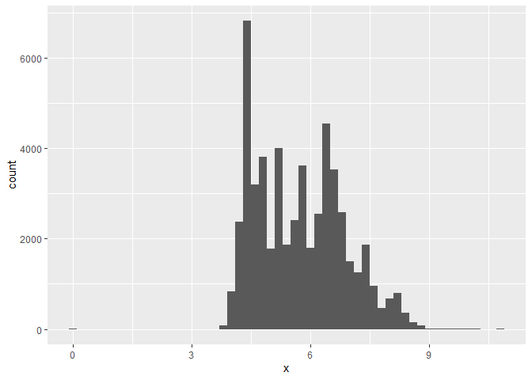<!-- -->

```r
diamonds %>% 
  ggplot() + 
  geom_histogram(aes(y), binwidth = 0.2) + 
  coord_cartesian(xlim = c(0, 15))
```

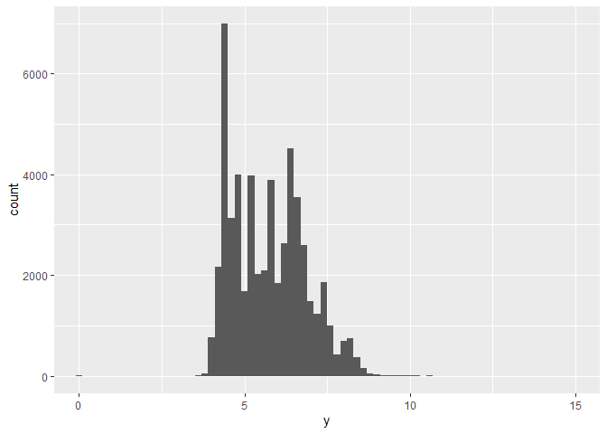<!-- -->

```r
diamonds %>% 
  ggplot() + 
  geom_histogram(aes(z), binwidth = 0.2) + 
  coord_cartesian(xlim = c(0, 10))
```

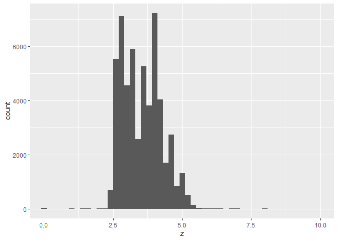<!-- -->

Distributions seem pretty tight, which isn't that surprising. Probably a general range of sizes that are pretty normal and anything larger is very unusual and expensive. There are longer tails to the right for all of these dimensions though, makes sense that there would be more large diamonds than tiny diamonds. 


```r
diamonds %>% 
  ggplot() + 
  geom_point(aes(x, y, color = z)) + 
  scale_color_viridis()
```

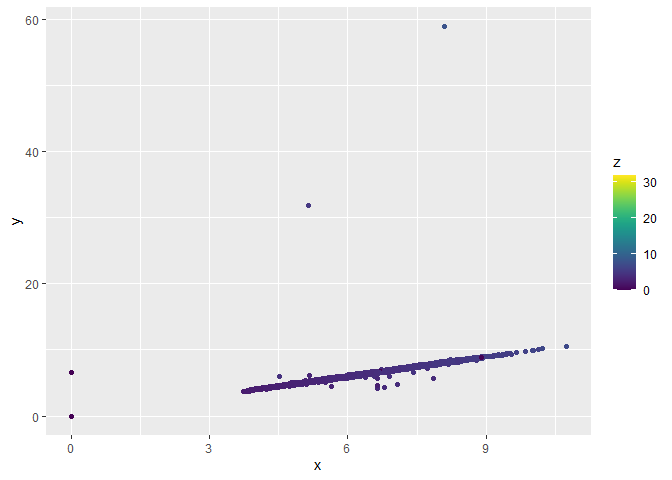<!-- -->


```r
diamonds %>% 
  ggplot() + 
  geom_point(aes(x, y, color = z)) + 
  scale_color_viridis() + 
  coord_cartesian(ylim = c(0, 20))
```

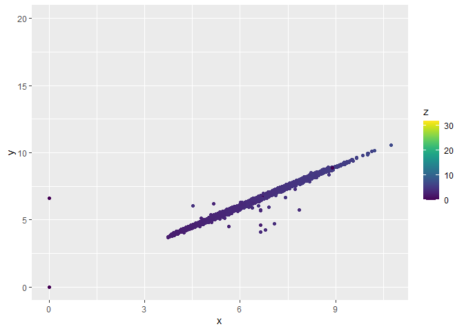<!-- -->
Relationship between `x` and `y` is pretty linear. About what I would expect? 

**2. Explore the distribution of price. Do you discover anything unusual or surprising? (Hint: Carefully think about the binwidth and make sure you try a wide range of values.)**    

```r
diamonds %>% select(price) %>% 
  summary()
```

```
##      price      
##  Min.   :  326  
##  1st Qu.:  950  
##  Median : 2401  
##  Mean   : 3933  
##  3rd Qu.: 5324  
##  Max.   :18823
```

```r
diamonds %>% 
  ggplot() + 
  geom_histogram(aes(price), binwidth = 50)
```

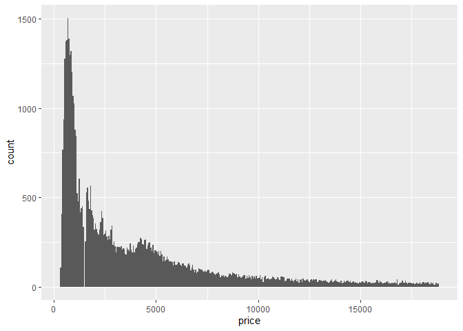<!-- -->

Weird gap in there? 

```r
diamonds %>% 
  ggplot() + 
  geom_histogram(aes(price), binwidth = 50) + 
  coord_cartesian(xlim = c(0, 2000))
```

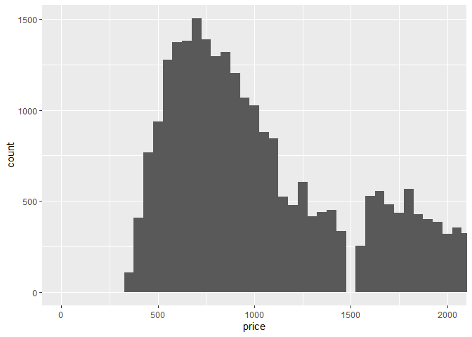<!-- -->

Data entry error? Maybe diamonds are just priced at 1499.99? Then it seems odd that this phenomenon is only observed at 1500 though and not at every hundred. 

**3. How many diamonds are 0.99 carat? How many are 1 carat? What do you think is the cause of the difference?**     

```r
diamonds %>% 
  select(carat) %>% 
  filter(carat %in% c(0.99, 1)) %>% 
  group_by(carat) %>% 
  count()
```

```
## # A tibble: 2 x 2
## # Groups:   carat [2]
##   carat     n
##   <dbl> <int>
## 1  0.99    23
## 2  1     1558
```

Well if you're only 0.01 carats away from 1 carat, *obviously* people would just spring for the even number. Bragging rights or whatever. 0.99 carats isn't as fun to tell your friends. 

**4. Compare and contrast coord_cartesian() vs xlim() or ylim() when zooming in on a histogram. What happens if you leave binwidth unset? What happens if you try and zoom so only half a bar shows?**    

```r
diamonds %>% 
  ggplot() + 
  geom_histogram(aes(carat)) + 
  coord_cartesian(xlim = c(0, 2))
```

```
## `stat_bin()` using `bins = 30`. Pick better value with `binwidth`.
```

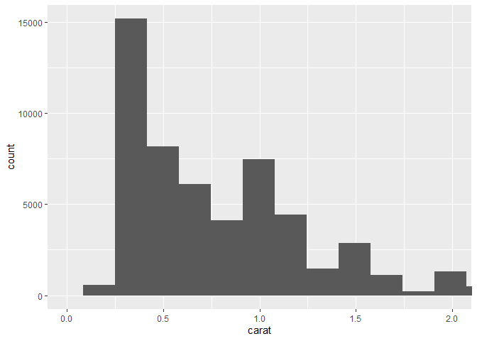<!-- -->

```r
diamonds %>% 
  ggplot() + 
  geom_histogram(aes(carat)) + 
  xlim(0, 2)
```

```
## `stat_bin()` using `bins = 30`. Pick better value with `binwidth`.
```

```
## Warning: Removed 1889 rows containing non-finite values (stat_bin).
```

```
## Warning: Removed 2 rows containing missing values (geom_bar).
```

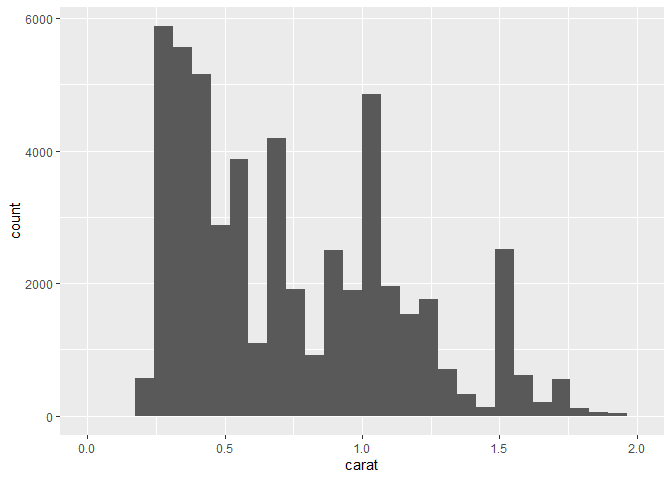<!-- -->

Since `coord_cartesian()` just zooms in, it will visualize half a bar on the edge of the plot. However, `xlim()` removes any data outside the specified range so it will not show half a bar on the edge. At least `xlim()` also lets you know how many data points it removed. 

#### 7.4.1

**1. What happens to missing values in a histogram? What happens to missing values in a bar chart? Why is there a difference?**    

```r
# histogram 
ggplot(flights) + 
  geom_histogram(aes(air_time), binwidth = 10)
```

```
## Warning: Removed 9430 rows containing non-finite values (stat_bin).
```

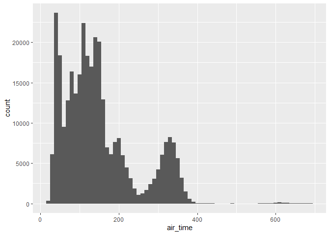<!-- -->

```r
# bar chart 
ggplot(flights) + 
  geom_bar(aes(air_time))
```

```
## Warning: Removed 9430 rows containing non-finite values (stat_count).
```

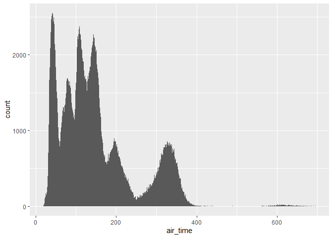<!-- -->

```r
# try categorical variable 
test_tibble <- tibble(color = sample(c(rep("blue", 5), rep("green", 5), rep("purple", 5), rep(NA, 20))))

# bar chart 
ggplot(test_tibble) + 
  geom_bar(aes(color))
```

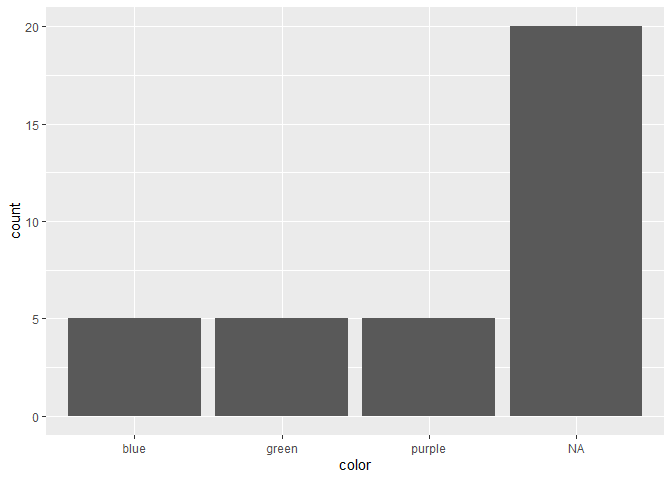<!-- -->

I only see a difference with categorical variables, otherwise missing values seem to be removed automatically. With categorical variables though, `NA` counts as its own category in a bar chart. 

**2. What does na.rm = TRUE do in mean() and sum()?**   

```r
x <- sample(c(seq(1:20), rep(NA, 5)))

# mean 
mean(x)
```

```
## [1] NA
```

```r
mean(x, na.rm = TRUE)
```

```
## [1] 10.5
```

```r
# sum
sum(x)
```

```
## [1] NA
```

```r
sum(x, na.rm = TRUE)
```

```
## [1] 210
```

It removes missing values. 

#### 7.5.1.1 

**1. Use what you’ve learned to improve the visualisation of the departure times of cancelled vs. non-cancelled flights.**   

```r
cancelled <- flights %>% 
  mutate(
    cancelled = is.na(dep_time),
    sched_hour = sched_dep_time %/% 100,
    sched_min = sched_dep_time %% 100,
    sched_dep_time = sched_hour + sched_min / 60
  )

ggplot(cancelled) + 
  geom_freqpoly(aes(sched_dep_time, color = cancelled), binwidth = 0.5) + 
  facet_wrap(~ cancelled, scales = "free")
```

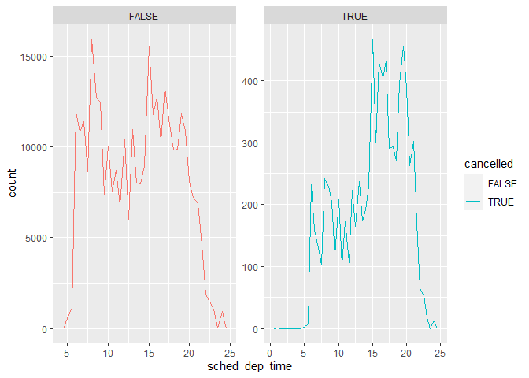<!-- -->

**2. What variable in the diamonds dataset is most important for predicting the price of a diamond? How is that variable correlated with cut? Why does the combination of those two relationships lead to lower quality diamonds being more expensive?**    

```r
ggplot(diamonds) + 
  geom_point(aes(carat, price)) + 
  facet_wrap(~ cut)
```

<!-- -->

```r
ggplot(diamonds) + 
  geom_boxplot(aes(cut, carat))
```

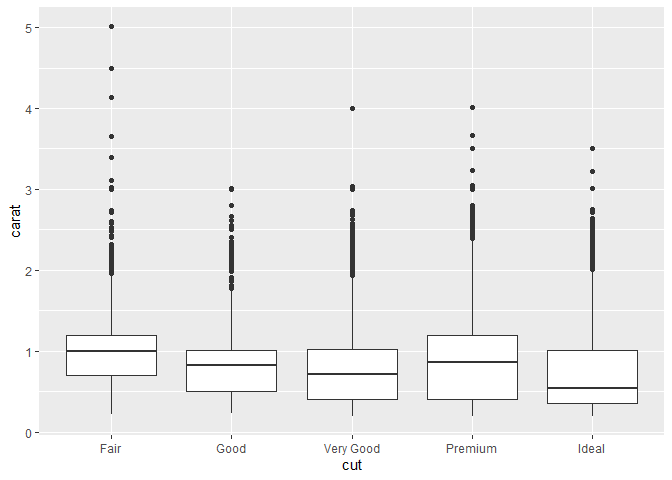<!-- -->

Lower quality diamonds are more expensive because they are larger!

**3. Install the ggstance package, and create a horizontal boxplot. How does this compare to using coord_flip()?**    

```r
library(ggstance)

# with coord_flip()
ggplot(mpg) + 
  geom_boxplot(aes(class, hwy)) + 
  coord_flip()
```

<!-- -->

```r
# ggstance
ggplot(mpg) + 
  geom_boxploth(aes(hwy, class))
```

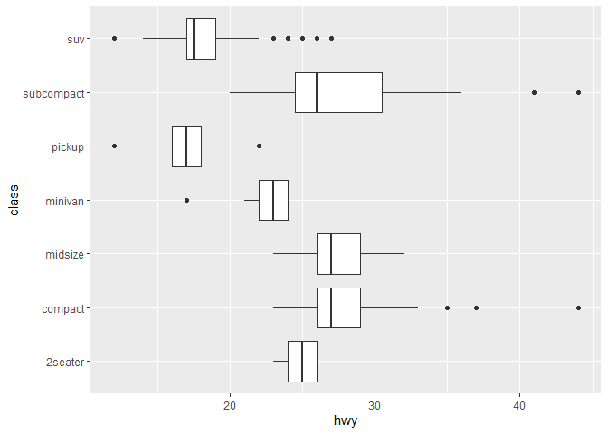<!-- -->

**5. Compare and contrast geom_violin() with a facetted geom_histogram(), or a coloured geom_freqpoly(). What are the pros and cons of each method?**    

```r
# geom_violin()
ggplot(diamonds) + 
  geom_violin(aes(cut, carat, fill = cut))
```

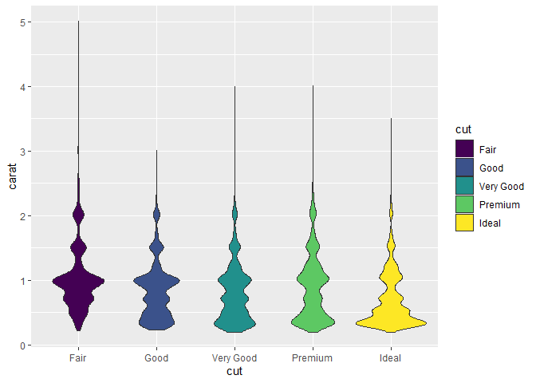<!-- -->

```r
# facetted geom_histogram()
ggplot(diamonds) + 
  geom_histogram(aes(carat), binwidth = 0.1) + 
  facet_grid(. ~ cut)
```

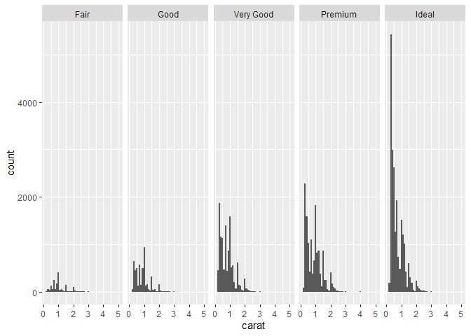<!-- -->

```r
# colored geom_freqpoly()
ggplot(diamonds) + 
  geom_freqpoly(aes(carat, color = cut), binwidth = 0.1)
```

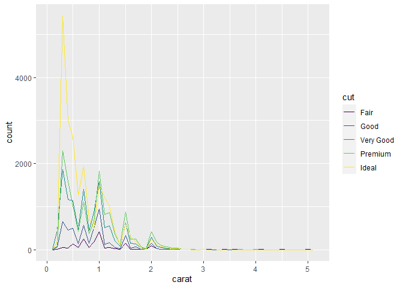<!-- -->

**6. If you have a small dataset, it’s sometimes useful to use geom_jitter() to see the relationship between a continuous and categorical variable. The ggbeeswarm package provides a number of methods similar to geom_jitter(). List them and briefly describe what each one does.**     

Check out the help file for ``ggbeeswarm`. 

#### 7.5.2

Two categorical variables: genotype and rhythmicity

#### 7.5.3

Two continuous variables: time and luminescence 


