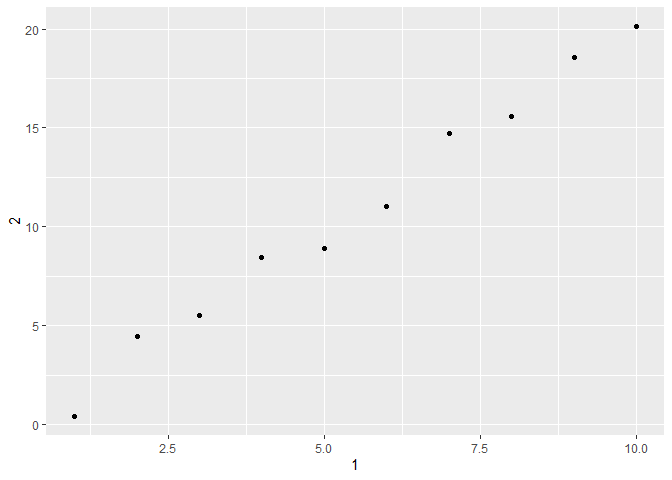

```r
library(tidyverse)
```

## Chapter 10 

You can use `.` in a pipe as a placeholder!   

```r
diamonds %>% filter(carat > 4) %>% .$carat
```

```
## [1] 4.01 4.01 4.13 5.01 4.50
```

### Exercises 

#### 10.5 

**1. How can you tell if an object is a tibble? (Hint: try printing `mtcars`, which is a regular data frame).** 

```r
print(mtcars)
```

```
##                      mpg cyl  disp  hp drat    wt  qsec vs am gear carb
## Mazda RX4           21.0   6 160.0 110 3.90 2.620 16.46  0  1    4    4
## Mazda RX4 Wag       21.0   6 160.0 110 3.90 2.875 17.02  0  1    4    4
## Datsun 710          22.8   4 108.0  93 3.85 2.320 18.61  1  1    4    1
## Hornet 4 Drive      21.4   6 258.0 110 3.08 3.215 19.44  1  0    3    1
## Hornet Sportabout   18.7   8 360.0 175 3.15 3.440 17.02  0  0    3    2
## Valiant             18.1   6 225.0 105 2.76 3.460 20.22  1  0    3    1
## Duster 360          14.3   8 360.0 245 3.21 3.570 15.84  0  0    3    4
## Merc 240D           24.4   4 146.7  62 3.69 3.190 20.00  1  0    4    2
## Merc 230            22.8   4 140.8  95 3.92 3.150 22.90  1  0    4    2
## Merc 280            19.2   6 167.6 123 3.92 3.440 18.30  1  0    4    4
## Merc 280C           17.8   6 167.6 123 3.92 3.440 18.90  1  0    4    4
## Merc 450SE          16.4   8 275.8 180 3.07 4.070 17.40  0  0    3    3
## Merc 450SL          17.3   8 275.8 180 3.07 3.730 17.60  0  0    3    3
## Merc 450SLC         15.2   8 275.8 180 3.07 3.780 18.00  0  0    3    3
## Cadillac Fleetwood  10.4   8 472.0 205 2.93 5.250 17.98  0  0    3    4
## Lincoln Continental 10.4   8 460.0 215 3.00 5.424 17.82  0  0    3    4
## Chrysler Imperial   14.7   8 440.0 230 3.23 5.345 17.42  0  0    3    4
## Fiat 128            32.4   4  78.7  66 4.08 2.200 19.47  1  1    4    1
## Honda Civic         30.4   4  75.7  52 4.93 1.615 18.52  1  1    4    2
## Toyota Corolla      33.9   4  71.1  65 4.22 1.835 19.90  1  1    4    1
## Toyota Corona       21.5   4 120.1  97 3.70 2.465 20.01  1  0    3    1
## Dodge Challenger    15.5   8 318.0 150 2.76 3.520 16.87  0  0    3    2
## AMC Javelin         15.2   8 304.0 150 3.15 3.435 17.30  0  0    3    2
## Camaro Z28          13.3   8 350.0 245 3.73 3.840 15.41  0  0    3    4
## Pontiac Firebird    19.2   8 400.0 175 3.08 3.845 17.05  0  0    3    2
## Fiat X1-9           27.3   4  79.0  66 4.08 1.935 18.90  1  1    4    1
## Porsche 914-2       26.0   4 120.3  91 4.43 2.140 16.70  0  1    5    2
## Lotus Europa        30.4   4  95.1 113 3.77 1.513 16.90  1  1    5    2
## Ford Pantera L      15.8   8 351.0 264 4.22 3.170 14.50  0  1    5    4
## Ferrari Dino        19.7   6 145.0 175 3.62 2.770 15.50  0  1    5    6
## Maserati Bora       15.0   8 301.0 335 3.54 3.570 14.60  0  1    5    8
## Volvo 142E          21.4   4 121.0 109 4.11 2.780 18.60  1  1    4    2
```

```r
print(diamonds)
```

```
## # A tibble: 53,940 x 10
##    carat cut       color clarity depth table price     x     y     z
##    <dbl> <ord>     <ord> <ord>   <dbl> <dbl> <int> <dbl> <dbl> <dbl>
##  1 0.23  Ideal     E     SI2      61.5    55   326  3.95  3.98  2.43
##  2 0.21  Premium   E     SI1      59.8    61   326  3.89  3.84  2.31
##  3 0.23  Good      E     VS1      56.9    65   327  4.05  4.07  2.31
##  4 0.290 Premium   I     VS2      62.4    58   334  4.2   4.23  2.63
##  5 0.31  Good      J     SI2      63.3    58   335  4.34  4.35  2.75
##  6 0.24  Very Good J     VVS2     62.8    57   336  3.94  3.96  2.48
##  7 0.24  Very Good I     VVS1     62.3    57   336  3.95  3.98  2.47
##  8 0.26  Very Good H     SI1      61.9    55   337  4.07  4.11  2.53
##  9 0.22  Fair      E     VS2      65.1    61   337  3.87  3.78  2.49
## 10 0.23  Very Good H     VS1      59.4    61   338  4     4.05  2.39
## # ... with 53,930 more rows
```

**2. Compare and contrast the following operations on a `data.frame` and equivalent tibble. What is different? Why might the default data frame behaviours cause you frustration?**   

```r
# make test data frame
df <- data.frame(abc = 1, xyz = "a")
# make test tibble
tib <- tibble(abc = 1, xyz = "a")
```


```r
df$x
```

```
## [1] a
## Levels: a
```

```r
tib$x
```

```
## Warning: Unknown or uninitialised column: `x`.
```

```
## NULL
```
The data frame lets you do this even though it doesn't match the column name, which may lead to you working with the wrong column on accident. 


```r
df[, "xyz"]
```

```
## [1] a
## Levels: a
```

```r
tib[, "xyz"]
```

```
## # A tibble: 1 x 1
##   xyz  
##   <chr>
## 1 a
```
With a tibble the output is also a tibble and is visually more pleasing. I kind of like how the data frame gives you the factor levels though. 


```r
df[, c("abc", "xyz")]
```

```
##   abc xyz
## 1   1   a
```

```r
tib[, c("abc", "xyz")]
```

```
## # A tibble: 1 x 2
##     abc xyz  
##   <dbl> <chr>
## 1     1 a
```
Again, the tibble outputs a tibble.

**4. Practice referring to non-syntactic names in the following data frame by:**  

  1. Extracting the variable called 1.   
  2. Plotting a scatterplot of 1 vs 2.    
  3. Creating a new column called 3 which is 2 divided by 1.    
  4. Renaming the columns to one, two and three.   
  

```r
annoying <- tibble(
  `1` = 1:10,
  `2` = `1` * 2 + rnorm(length(`1`))
)
```


```r
# extract variable 1
annoying$`1`
```

```
##  [1]  1  2  3  4  5  6  7  8  9 10
```

```r
annoying %>% select(`1`)
```

```
## # A tibble: 10 x 1
##      `1`
##    <int>
##  1     1
##  2     2
##  3     3
##  4     4
##  5     5
##  6     6
##  7     7
##  8     8
##  9     9
## 10    10
```


```r
# plot scatterplot of 1 vs 2
annoying %>% 
  ggplot(aes(`1`, `2`)) + 
  geom_point()
```

<!-- -->


```r
# create column called 3, which is 2 divided by 1 
(annoying <- annoying %>% 
  mutate(
    `3` = `2`/`1`
  ))
```

```
## # A tibble: 10 x 3
##      `1`    `2`   `3`
##    <int>  <dbl> <dbl>
##  1     1  0.431 0.431
##  2     2  4.44  2.22 
##  3     3  5.50  1.83 
##  4     4  8.44  2.11 
##  5     5  8.92  1.78 
##  6     6 11.0   1.84 
##  7     7 14.7   2.10 
##  8     8 15.6   1.95 
##  9     9 18.5   2.06 
## 10    10 20.1   2.01
```


```r
# rename columns to one, two, and three
annoying %>% 
  rename(
    one = `1`, 
    two = `2`, 
    three = `3`
  )
```

```
## # A tibble: 10 x 3
##      one    two three
##    <int>  <dbl> <dbl>
##  1     1  0.431 0.431
##  2     2  4.44  2.22 
##  3     3  5.50  1.83 
##  4     4  8.44  2.11 
##  5     5  8.92  1.78 
##  6     6 11.0   1.84 
##  7     7 14.7   2.10 
##  8     8 15.6   1.95 
##  9     9 18.5   2.06 
## 10    10 20.1   2.01
```

**5. What does `tibble::enframe()` do? When might you use it?**   

`enframe()` creates tibbles from vectors. This would be useful if you had multiple vectors you wanted to combine together into one data frame/tibble. 

## Chapter 11 

### Exercises 

#### 11.2.2 

**1. What function would you use to read a file where fields were separated with “|”?**   

```r
read_delim("a|b|c
1|2|3
4|5|6", delim = "|")
```

```
## # A tibble: 2 x 3
##       a     b     c
##   <dbl> <dbl> <dbl>
## 1     1     2     3
## 2     4     5     6
```

**4. Sometimes strings in a CSV file contain commas. To prevent them from causing problems they need to be surrounded by a quoting character, like `"` or `'`. By default, `read_csv()` assumes that the quoting character will be `"`. What argument to `read_csv()` do you need to specify to read the following text into a data frame?**   

```r
read_csv("x,y\n1,'a,b'", quote = "'")
```

```
## # A tibble: 1 x 2
##       x y    
##   <dbl> <chr>
## 1     1 a,b
```

**5. Identify what is wrong with each of the following inline CSV files. What happens when you run the code?** 

```r
# missing a third column header 
read_csv("a,b\n1,2,3\n4,5,6")
```

```
## Warning: 2 parsing failures.
## row col  expected    actual         file
##   1  -- 2 columns 3 columns literal data
##   2  -- 2 columns 3 columns literal data
```

```
## # A tibble: 2 x 2
##       a     b
##   <dbl> <dbl>
## 1     1     2
## 2     4     5
```

```r
# has three column headers, but only two values in the first row and four values in the second row 
read_csv("a,b,c\n1,2\n1,2,3,4")
```

```
## Warning: 2 parsing failures.
## row col  expected    actual         file
##   1  -- 3 columns 2 columns literal data
##   2  -- 3 columns 4 columns literal data
```

```
## # A tibble: 2 x 3
##       a     b     c
##   <dbl> <dbl> <dbl>
## 1     1     2    NA
## 2     1     2     3
```

```r
# missing a value for the second column 
read_csv("a,b\n\"1")
```

```
## Warning: 2 parsing failures.
## row col                     expected    actual         file
##   1  a  closing quote at end of file           literal data
##   1  -- 2 columns                    1 columns literal data
```

```
## # A tibble: 1 x 2
##       a b    
##   <dbl> <chr>
## 1     1 <NA>
```

```r
# not sure what they were going for here? maybe need quotes around values to have "a,b" as one value?
read_csv("a,b\n1,2\na,b")
```

```
## # A tibble: 2 x 2
##   a     b    
##   <chr> <chr>
## 1 1     2    
## 2 a     b
```

```r
# use read_csv2?
read_csv("a;b\n1;3")
```

```
## # A tibble: 1 x 1
##   `a;b`
##   <chr>
## 1 1;3
```

#### 11.3.5

**1. What are the most important arguments to `locale()`?**    
Most important seems subjective, but there are definitely a lot of useful settings in here!

**2. What happens if you try and set `decimal_mark` and `grouping_mark` to the same character? What happens to the default value of `grouping_mark` when you set `decimal_mark` to `“,”`? What happens to the default value of `decimal_mark` when you set the `grouping_mark` to `“.”`?**    

```r
# locale(decimal_mark = ".", grouping_mark = ".")
# "decimal_mark and grouping_mark must be different)

parse_number("$123.456,50", locale = locale(decimal_mark = ","))
```

```
## [1] 123456.5
```

```r
parse_number("$123.456,50", locale = locale(grouping_mark = "."))
```

```
## [1] 123456.5
```

`decimal_mark` and `grouping_mark` will just automatically switch with each other. 

**3. I didn’t discuss the `date_format` and `time_format` options to `locale()`. What do they do? Construct an example that shows when they might be useful.**    

`date_format` sets the default date format and `time_format` sets the default time format.  

```r
parse_date("05 January 2010", locale = locale(date_format = "%d %B %Y"))
```

```
## [1] "2010-01-05"
```

```r
parse_time("1330", locale = locale(time_format = "%H%M"))
```

```
## 13:30:00
```

**7. Generate the correct format string to parse each of the following dates and times:** 

```r
d1 <- "January 1, 2010"
d2 <- "2015-Mar-07"
d3 <- "06-Jun-2017"
d4 <- c("August 19 (2015)", "July 1 (2015)")
d5 <- "12/30/14" # Dec 30, 2014
t1 <- "1705"
t2 <- "11:15:10.12 PM"
```


```r
parse_date(d1, "%B %d, %Y")
```

```
## [1] "2010-01-01"
```

```r
parse_date(d2, "%Y-%b-%d")
```

```
## [1] "2015-03-07"
```

```r
parse_date(d3, "%d-%b-%Y")
```

```
## [1] "2017-06-06"
```

```r
parse_date(d4, "%B %d (%Y)")
```

```
## [1] "2015-08-19" "2015-07-01"
```

```r
parse_date(d5, "%m/%d/%y")
```

```
## [1] "2014-12-30"
```

```r
parse_time(t1, "%H%M")
```

```
## 17:05:00
```

```r
parse_time(t2, "%I:%M:%OS %p")
```

```
## 23:15:10.12
```

