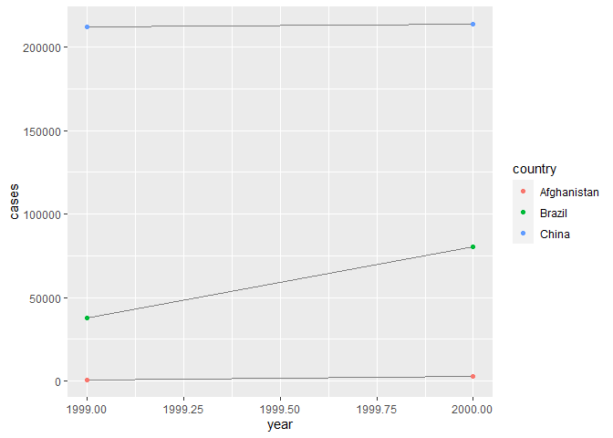
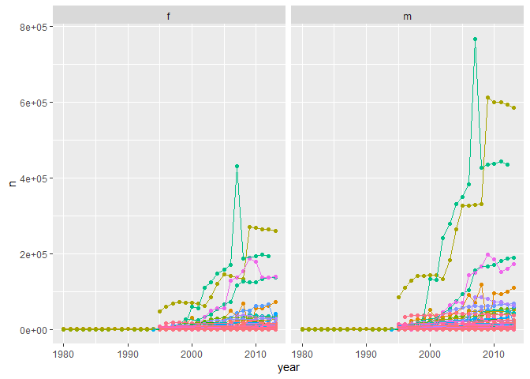

```r
library(tidyverse)
```

## Chapter 12

### Exercises 

#### 12.2.1 

**1. Using prose, describe how the variables and observations are organised in each of the sample tables.**   
In `table1` each variable has its own column. In `table2` some variables share columns. In `table3` some values share cells. In `table4a` and `table4b` some variables are spread across multiple columns and some are spread across multiple tables. 

**2. Compute the `rate` for `table2`, and `table4a` + `table4b`. You will need to perform four operations:**    

  1. Extract the number of TB cases per country per year.
  2. Extract the matching population per country per year.
  3. Divide cases by population, and multiply by 10000.
  4. Store back in the appropriate place.
  
**Which representation is easiest to work with? Which is hardest? Why?**    


```r
# for table 2
## extract cases
cases <- table2 %>% filter(type == "cases")
## extract population
pop <- table2 %>% filter(type == "population")
## calculate rate 
rate <- tibble(
  country = rep(unique(table2$country), times = rep_len(length(unique(table2$year)), length.out = length(unique(table2$country)))),
  year = rep(unique(table2$year), times = length(unique(table2$country))),
  type = "rate",
  count = cases$count / pop$count * 10000
)

## store in table2
table2_mod <- rbind(table2, rate) %>% 
  arrange(country, year, type) 
table2_mod 
```

```
## # A tibble: 18 x 4
##    country      year type         count
##    <chr>       <int> <chr>        <dbl>
##  1 Afghanistan  1999 cases      7.45e+2
##  2 Afghanistan  1999 population 2.00e+7
##  3 Afghanistan  1999 rate       3.73e-1
##  4 Afghanistan  2000 cases      2.67e+3
##  5 Afghanistan  2000 population 2.06e+7
##  6 Afghanistan  2000 rate       1.29e+0
##  7 Brazil       1999 cases      3.77e+4
##  8 Brazil       1999 population 1.72e+8
##  9 Brazil       1999 rate       2.19e+0
## 10 Brazil       2000 cases      8.05e+4
## 11 Brazil       2000 population 1.75e+8
## 12 Brazil       2000 rate       4.61e+0
## 13 China        1999 cases      2.12e+5
## 14 China        1999 population 1.27e+9
## 15 China        1999 rate       1.67e+0
## 16 China        2000 cases      2.14e+5
## 17 China        2000 population 1.28e+9
## 18 China        2000 rate       1.67e+0
```


```r
# for table 4a + 4b
## cases and population are already 'extracted'
## calculate rate 
table4c <- tibble(
  country = table4a$country,
  `1999` = table4a$`1999` / table4b$`1999` * 10000,
  `2000` = table4a$`2000` / table4b$`2000` * 10000
)
table4c
```

```
## # A tibble: 3 x 3
##   country     `1999` `2000`
##   <chr>        <dbl>  <dbl>
## 1 Afghanistan  0.373   1.29
## 2 Brazil       2.19    4.61
## 3 China        1.67    1.67
```

I guess here `table4` is easier to work with, but it frustratingly does not have all the data conveniently stored together. Conversely, `table2` does have everything stored together but is a pain to work with. Tidy data fixes these problems! 

**3. Recreate the plot showing change in cases over time using `table2` instead of `table1`. What do you need to do first?**      


```r
# need to filter
table2 %>% filter(type == "cases") %>% 
  ggplot(aes(year, count)) + 
  geom_line(aes(group = country), color = "grey50") + 
  geom_point(aes(color = country)) + 
  ylab("cases")
```

<!-- -->

#### 12.3.3 

**1. Why are `pivot_longer()` and `pivot_wider()` not perfectly symmetrical?**   
**Carefully consider the following example:**     

```r
stocks <- tibble(
  year   = c(2015, 2015, 2016, 2016),
  half  = c(   1,    2,     1,    2),
  return = c(1.88, 0.59, 0.92, 0.17)
)
stocks %>% 
  pivot_wider(names_from = year, values_from = return) %>% 
  pivot_longer(`2015`:`2016`, names_to = "year", values_to = "return")
```

```
## # A tibble: 4 x 3
##    half year  return
##   <dbl> <chr>  <dbl>
## 1     1 2015    1.88
## 2     1 2016    0.92
## 3     2 2015    0.59
## 4     2 2016    0.17
```
**(Hint: look at the variable types and think about column names.)**

Looks like `year` has lost its variables type. So I suppose these are not perfectly symmetrical because column names don't have a type associated with them, so as soon as variables are moved into columns their type is lost. 

**`pivot_longer()` has a `names_ptype argument`, e.g. `names_ptype = list(year = double())`. What does it do?**    


```r
stocks %>% 
  pivot_wider(names_from = year, values_from = return) %>% 
  pivot_longer(`2015`:`2016`, names_to = "year", values_to = "return", names_ptype = list(year = double()))
```

```
## # A tibble: 4 x 3
##    half  year return
##   <dbl> <dbl>  <dbl>
## 1     1  2015   1.88
## 2     1  2016   0.92
## 3     2  2015   0.59
## 4     2  2016   0.17
```

This argument specifies what type your 'new' variable should be. Handy!

**2. Why does this code fail?**   
```
table4a %>% 
  pivot_longer(c(1999, 2000), names_to = "year", values_to = "cases")
#> Error: Can't subset columns that don't exist.
#> ✖ The locations 1999 and 2000 don't exist.
#> ℹ There are only 3 columns.
```

This probably fails because "1999" and "2000" are non-syntactic names but are not surrounded by `` ` `` in the previous code. 

```r
table4a %>% 
  pivot_longer(c(`1999`, `2000`), names_to = "year", values_to = "cases")
```

```
## # A tibble: 6 x 3
##   country     year   cases
##   <chr>       <chr>  <int>
## 1 Afghanistan 1999     745
## 2 Afghanistan 2000    2666
## 3 Brazil      1999   37737
## 4 Brazil      2000   80488
## 5 China       1999  212258
## 6 China       2000  213766
```

**3. What would happen if you widen this table? Why? How could you add a new column to uniquely identify each value?** 

```r
people <- tribble(
  ~name,             ~names,  ~values,
  #-----------------|--------|------
  "Phillip Woods",   "age",       45,
  "Phillip Woods",   "height",   186,
  "Phillip Woods",   "age",       50,
  "Jessica Cordero", "age",       37,
  "Jessica Cordero", "height",   156
)
```


```r
people %>% pivot_wider(names_from = names, values_from = values)
```

```
## Warning: Values in `values` are not uniquely identified; output will contain list-cols.
## * Use `values_fn = list(values = list)` to suppress this warning.
## * Use `values_fn = list(values = length)` to identify where the duplicates arise
## * Use `values_fn = list(values = summary_fun)` to summarise duplicates
```

```
## # A tibble: 2 x 3
##   name            age       height   
##   <chr>           <list>    <list>   
## 1 Phillip Woods   <dbl [2]> <dbl [1]>
## 2 Jessica Cordero <dbl [1]> <dbl [1]>
```

R actually lets you know that there are multiple values for one observation (because there are two different people named "Phillip Woods"). You could add a unique ID number for each person. 

```r
people %>% 
  mutate(ID = c(1, 1, 2, 3, 3)) %>% 
  pivot_wider(names_from = names, values_from = values)
```

```
## # A tibble: 3 x 4
##   name               ID   age height
##   <chr>           <dbl> <dbl>  <dbl>
## 1 Phillip Woods       1    45    186
## 2 Phillip Woods       2    50     NA
## 3 Jessica Cordero     3    37    156
```

**4. Tidy the simple tibble below. Do you need to make it wider or longer? What are the variables?**   

```r
preg <- tribble(
  ~pregnant, ~male, ~female,
  "yes",     NA,    10,
  "no",      20,    12
)
```

Need to make this longer because values of a variable are column names. The variables are `pregnant`, `sex`, and `count`. 

```r
preg %>% pivot_longer(c("male", "female"), names_to = "sex", values_to = "count")
```

```
## # A tibble: 4 x 3
##   pregnant sex    count
##   <chr>    <chr>  <dbl>
## 1 yes      male      NA
## 2 yes      female    10
## 3 no       male      20
## 4 no       female    12
```

#### 12.4.3

**1. What do the `extra` and `fill` arguments do in `separate()`? Experiment with the various options for the following two toy datasets.**    

```r
tibble(x = c("a,b,c", "d,e,f,g", "h,i,j")) %>% 
  separate(x, c("one", "two", "three"))
```

```
## Warning: Expected 3 pieces. Additional pieces discarded in 1 rows [2].
```

```
## # A tibble: 3 x 3
##   one   two   three
##   <chr> <chr> <chr>
## 1 a     b     c    
## 2 d     e     f    
## 3 h     i     j
```

```r
tibble(x = c("a,b,c", "d,e", "f,g,i")) %>% 
  separate(x, c("one", "two", "three"))
```

```
## Warning: Expected 3 pieces. Missing pieces filled with `NA` in 1 rows [2].
```

```
## # A tibble: 3 x 3
##   one   two   three
##   <chr> <chr> <chr>
## 1 a     b     c    
## 2 d     e     <NA> 
## 3 f     g     i
```

`extra` determines what happens with too many observations and `fill` determines what happens with too few observations. 

```r
tibble(x = c("a,b,c", "d,e,f,g", "h,i,j")) %>% 
  separate(x, c("one", "two", "three"), extra = "merge")
```

```
## # A tibble: 3 x 3
##   one   two   three
##   <chr> <chr> <chr>
## 1 a     b     c    
## 2 d     e     f,g  
## 3 h     i     j
```

```r
tibble(x = c("a,b,c", "d,e", "f,g,i")) %>% 
  separate(x, c("one", "two", "three"), fill = "left")
```

```
## # A tibble: 3 x 3
##   one   two   three
##   <chr> <chr> <chr>
## 1 a     b     c    
## 2 <NA>  d     e    
## 3 f     g     i
```

**2. Both `unite()` and `separate()` have a `remove` argument. What does it do? Why would you set it to `FALSE`?** 
The `remove` argument will remove the original input column by default. You would set this to `FALSE` if you want to keep the original input in addition to the newly generated output(s).   

```r
table3 %>% separate(year, into = "century", sep = 2, remove = FALSE)
```

```
## # A tibble: 6 x 4
##   country      year century rate             
##   <chr>       <int> <chr>   <chr>            
## 1 Afghanistan  1999 19      745/19987071     
## 2 Afghanistan  2000 20      2666/20595360    
## 3 Brazil       1999 19      37737/172006362  
## 4 Brazil       2000 20      80488/174504898  
## 5 China        1999 19      212258/1272915272
## 6 China        2000 20      213766/1280428583
```

**3. Compare and contrast `separate()` and `extract()`. Why are there three variations of separation (by position, by separator, and with groups), but only one unite?**   

Seems like `separate()` generally splits on a separator or position while `extract()` uses regular expressions to separate by groups. There are a lot of different ways that I can imagine wanting to separate values, but uniting values seems to have a more universal mechanism/output. 

#### 12.6.1


```r
who_tidy <- who %>%
  pivot_longer(
    cols = new_sp_m014:newrel_f65, 
    names_to = "key", 
    values_to = "cases", 
    values_drop_na = TRUE
  ) %>% 
  mutate(
    key = stringr::str_replace(key, "newrel", "new_rel")
  ) %>%
  separate(key, c("new", "var", "sexage")) %>% 
  select(-new, -iso2, -iso3) %>% 
  separate(sexage, c("sex", "age"), sep = 1)
```

**3. I claimed that `iso2` and `iso3` were redundant with `country`. Confirm this claim.**    

```r
who %>% select(1:3) %>% 
  unique() %>% 
  count(country) %>% 
  filter(n > 1)
```

```
## # A tibble: 0 x 2
## # ... with 2 variables: country <chr>, n <int>
```

**4. For each country, year, and sex compute the total number of cases of TB. Make an informative visualisation of the data.**    

```r
who_tidy %>% 
  count(country, year, sex, wt = cases) %>% 
  ggplot(aes(year, n, color = country)) + 
  geom_point() + 
  geom_line() + 
  facet_wrap(~ sex) + 
  theme(legend.position = "none")
```

<!-- -->

There are so many countries that this isn't great, but it does look like males may have higher frequency of TB? 

## Joins Tutorial

### Types 

* `inner_join`: only keeps rows with a key shared in both datasets    
* `left_join`: keeps all rows from left dataset and only keeps rows from right dataset that have a matching key with the left dataset    
* `right_join`: keeps all rows from right dataset and only keeps rows from left dataset that have a matching key with the right dataset    
* `full_join`: keeps all rows from both datasets   

### Keys    

If the key is under a different column name in the two datasets, you can specify that the two different names are equivalent with `by`.   
