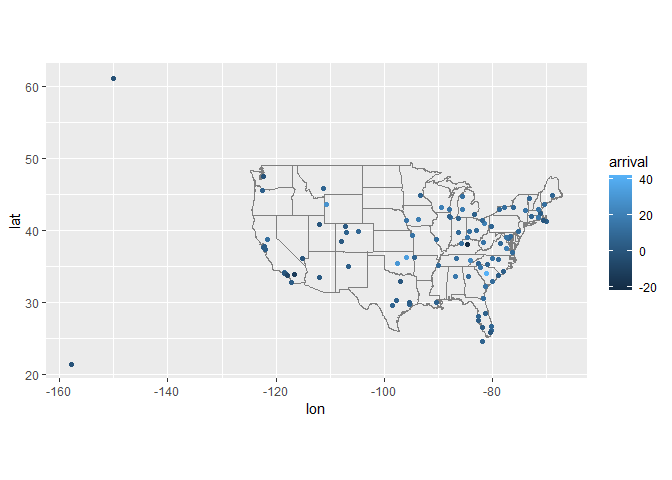
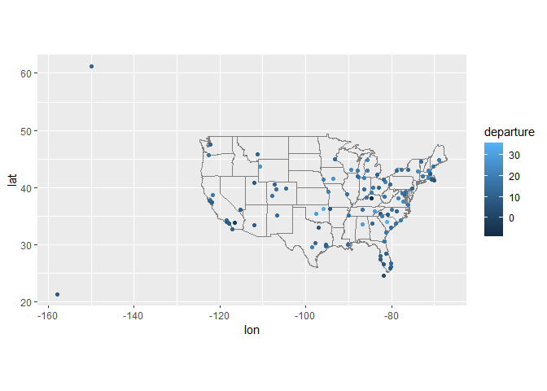
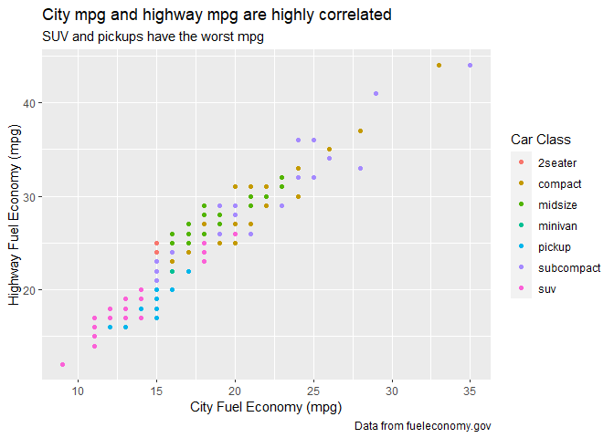
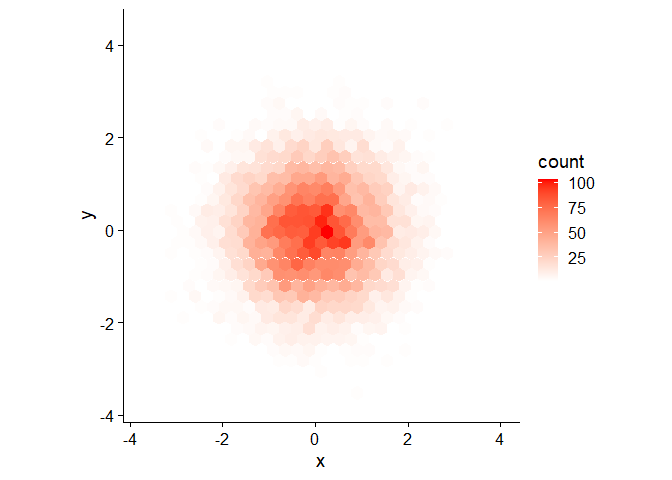
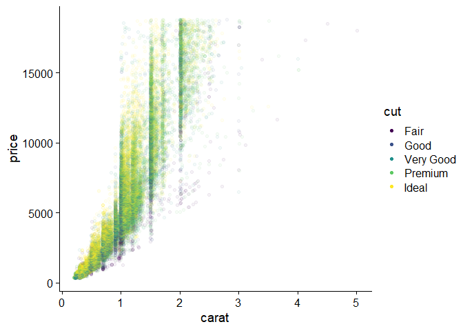

```r
library(tidyverse)
library(nycflights13)
library(cowplot) 
theme_set(theme_cowplot())
library(hexbin)
```

## Chapter 13 

### 13.2.1 

**1. Imagine you wanted to draw (approximately) the route each plane flies from its origin to its destination. What variables would you need? What tables would you need to combine?**

```r
head(airports)
```

```
## # A tibble: 6 x 8
##   faa   name                          lat   lon   alt    tz dst   tzone         
##   <chr> <chr>                       <dbl> <dbl> <dbl> <dbl> <chr> <chr>         
## 1 04G   Lansdowne Airport            41.1 -80.6  1044    -5 A     America/New_Y~
## 2 06A   Moton Field Municipal Airp~  32.5 -85.7   264    -6 A     America/Chica~
## 3 06C   Schaumburg Regional          42.0 -88.1   801    -6 A     America/Chica~
## 4 06N   Randall Airport              41.4 -74.4   523    -5 A     America/New_Y~
## 5 09J   Jekyll Island Airport        31.1 -81.4    11    -5 A     America/New_Y~
## 6 0A9   Elizabethton Municipal Air~  36.4 -82.2  1593    -5 A     America/New_Y~
```

```r
head(flights)
```

```
## # A tibble: 6 x 19
##    year month   day dep_time sched_dep_time dep_delay arr_time sched_arr_time
##   <int> <int> <int>    <int>          <int>     <dbl>    <int>          <int>
## 1  2013     1     1      517            515         2      830            819
## 2  2013     1     1      533            529         4      850            830
## 3  2013     1     1      542            540         2      923            850
## 4  2013     1     1      544            545        -1     1004           1022
## 5  2013     1     1      554            600        -6      812            837
## 6  2013     1     1      554            558        -4      740            728
## # ... with 11 more variables: arr_delay <dbl>, carrier <chr>, flight <int>,
## #   tailnum <chr>, origin <chr>, dest <chr>, air_time <dbl>, distance <dbl>,
## #   hour <dbl>, minute <dbl>, time_hour <dttm>
```

You would need the location of each airport, so `lat` and `lon` from `airports` along with `faa`. You would also need the `origin` and `dest` from `flights`, which corresponds with `faa` from `airports`. You would need to combine `flights` and `airports`. 

**2. I forgot to draw the relationship between weather and airports. What is the relationship and how should it appear in the diagram?**     

```r
head(weather)
```

```
## # A tibble: 6 x 15
##   origin  year month   day  hour  temp  dewp humid wind_dir wind_speed wind_gust
##   <chr>  <int> <int> <int> <int> <dbl> <dbl> <dbl>    <dbl>      <dbl>     <dbl>
## 1 EWR     2013     1     1     1  39.0  26.1  59.4      270      10.4         NA
## 2 EWR     2013     1     1     2  39.0  27.0  61.6      250       8.06        NA
## 3 EWR     2013     1     1     3  39.0  28.0  64.4      240      11.5         NA
## 4 EWR     2013     1     1     4  39.9  28.0  62.2      250      12.7         NA
## 5 EWR     2013     1     1     5  39.0  28.0  64.4      260      12.7         NA
## 6 EWR     2013     1     1     6  37.9  28.0  67.2      240      11.5         NA
## # ... with 4 more variables: precip <dbl>, pressure <dbl>, visib <dbl>,
## #   time_hour <dttm>
```

```r
head(airports)
```

```
## # A tibble: 6 x 8
##   faa   name                          lat   lon   alt    tz dst   tzone         
##   <chr> <chr>                       <dbl> <dbl> <dbl> <dbl> <chr> <chr>         
## 1 04G   Lansdowne Airport            41.1 -80.6  1044    -5 A     America/New_Y~
## 2 06A   Moton Field Municipal Airp~  32.5 -85.7   264    -6 A     America/Chica~
## 3 06C   Schaumburg Regional          42.0 -88.1   801    -6 A     America/Chica~
## 4 06N   Randall Airport              41.4 -74.4   523    -5 A     America/New_Y~
## 5 09J   Jekyll Island Airport        31.1 -81.4    11    -5 A     America/New_Y~
## 6 0A9   Elizabethton Municipal Air~  36.4 -82.2  1593    -5 A     America/New_Y~
```

`airports` connects to `weather` through `faa`, which corresponds to `origin` in `weather`. This should be portrayed as an arrow between `faa` and `origin`. 

**3. `weather` only contains information for the origin (NYC) airports. If it contained weather records for all airports in the USA, what additional relation would it define with `flights`?**      

`dest` would also be defined with `flights`. 

**4. We know that some days of the year are “special”, and fewer people than usual fly on them. How might you represent that data as a data frame? What would be the primary keys of that table? How would it connect to the existing tables?** 

You could make a `holidays` data frame that includes `name`, `month`, and `day`. The primary keys would be `month` and `day`, which is how it would connect to `flights` and `weather`. 

### 13.3.1

**1. Add a surrogate key to `flights`.**    


```r
flights2 <- flights %>% mutate(
  key = row_number()
)

flights2 %>% select(key, everything()) %>% head()
```

```
## # A tibble: 6 x 20
##     key  year month   day dep_time sched_dep_time dep_delay arr_time
##   <int> <int> <int> <int>    <int>          <int>     <dbl>    <int>
## 1     1  2013     1     1      517            515         2      830
## 2     2  2013     1     1      533            529         4      850
## 3     3  2013     1     1      542            540         2      923
## 4     4  2013     1     1      544            545        -1     1004
## 5     5  2013     1     1      554            600        -6      812
## 6     6  2013     1     1      554            558        -4      740
## # ... with 12 more variables: sched_arr_time <int>, arr_delay <dbl>,
## #   carrier <chr>, flight <int>, tailnum <chr>, origin <chr>, dest <chr>,
## #   air_time <dbl>, distance <dbl>, hour <dbl>, minute <dbl>, time_hour <dttm>
```

**2. Identify the keys in the following datasets:**    

  1. Lahman::Batting,
  2. babynames::babynames
  
**(You might need to install some packages and read some documentation.)** 


```r
library(Lahman)
head(Batting)
```

```
##    playerID yearID stint teamID lgID  G  AB  R  H X2B X3B HR RBI SB CS BB SO
## 1 abercda01   1871     1    TRO   NA  1   4  0  0   0   0  0   0  0  0  0  0
## 2  addybo01   1871     1    RC1   NA 25 118 30 32   6   0  0  13  8  1  4  0
## 3 allisar01   1871     1    CL1   NA 29 137 28 40   4   5  0  19  3  1  2  5
## 4 allisdo01   1871     1    WS3   NA 27 133 28 44  10   2  2  27  1  1  0  2
## 5 ansonca01   1871     1    RC1   NA 25 120 29 39  11   3  0  16  6  2  2  1
## 6 armstbo01   1871     1    FW1   NA 12  49  9 11   2   1  0   5  0  1  0  1
##   IBB HBP SH SF GIDP
## 1  NA  NA NA NA    0
## 2  NA  NA NA NA    0
## 3  NA  NA NA NA    1
## 4  NA  NA NA NA    0
## 5  NA  NA NA NA    0
## 6  NA  NA NA NA    0
```

```r
Batting %>% count(playerID, yearID, stint) %>% filter(n > 1)
```

```
## # A tibble: 0 x 4
## # ... with 4 variables: playerID <chr>, yearID <int>, stint <int>, n <int>
```

```r
library(babynames)
head(babynames)
```

```
## # A tibble: 6 x 5
##    year sex   name          n   prop
##   <dbl> <chr> <chr>     <int>  <dbl>
## 1  1880 F     Mary       7065 0.0724
## 2  1880 F     Anna       2604 0.0267
## 3  1880 F     Emma       2003 0.0205
## 4  1880 F     Elizabeth  1939 0.0199
## 5  1880 F     Minnie     1746 0.0179
## 6  1880 F     Margaret   1578 0.0162
```

```r
babynames %>% count(year, sex, name) %>% filter(n > 1)
```

```
## # A tibble: 0 x 4
## # ... with 4 variables: year <dbl>, sex <chr>, name <chr>, n <int>
```

### 13.4.6 

**1. Compute the average delay by destination, then join on the `airports` data frame so you can show the spatial distribution of delays. Here’s an easy way to draw a map of the United States:**  
```
airports %>%
  semi_join(flights, c("faa" = "dest")) %>%
  ggplot(aes(lon, lat)) +
    borders("state") +
    geom_point() +
    coord_quickmap()
```
**(Don’t worry if you don’t understand what semi_join() does — you’ll learn about it next.)**    
**You might want to use the size or colour of the points to display the average delay for each airport.**     

```r
# compute average delay by destination
avg_delay <- flights %>% 
  group_by(dest) %>% 
  summarise(
    arrival = mean(arr_delay, na.rm = TRUE),
    departure = mean(dep_delay, na.rm = TRUE))

# join on airports 
avg_delay %>% 
  left_join(airports, c("dest" = "faa")) %>% 
  ggplot(aes(lon, lat)) +
    borders("state") +
    geom_point(aes(color = arrival)) +
    coord_quickmap()
```

```
## Warning: Removed 4 rows containing missing values (geom_point).
```

<!-- -->

```r
avg_delay %>% 
  left_join(airports, c("dest" = "faa")) %>% 
  ggplot(aes(lon, lat)) +
    borders("state") +
    geom_point(aes(color = departure)) +
    coord_quickmap()
```

```
## Warning: Removed 4 rows containing missing values (geom_point).
```

<!-- -->

**2. Add the location of the origin *and* destination (i.e. the `lat` and `lon`) to `flights`.**  


```r
location <- airports %>% 
  select(faa, lat, lon)

flights %>% 
  left_join(location, c("dest" = "faa")) %>% 
  rename(dest_lat = lat,
         dest_lon = lon) %>% 
  left_join(location, c("origin" = "faa")) %>% 
  rename(origin_lat = lat,
         origin_lon = lon) %>% 
  select(origin, origin_lat, origin_lon, dest, dest_lat, dest_lon, everything())
```

```
## # A tibble: 336,776 x 23
##    origin origin_lat origin_lon dest  dest_lat dest_lon  year month   day
##    <chr>       <dbl>      <dbl> <chr>    <dbl>    <dbl> <int> <int> <int>
##  1 EWR          40.7      -74.2 IAH       30.0    -95.3  2013     1     1
##  2 LGA          40.8      -73.9 IAH       30.0    -95.3  2013     1     1
##  3 JFK          40.6      -73.8 MIA       25.8    -80.3  2013     1     1
##  4 JFK          40.6      -73.8 BQN       NA       NA    2013     1     1
##  5 LGA          40.8      -73.9 ATL       33.6    -84.4  2013     1     1
##  6 EWR          40.7      -74.2 ORD       42.0    -87.9  2013     1     1
##  7 EWR          40.7      -74.2 FLL       26.1    -80.2  2013     1     1
##  8 LGA          40.8      -73.9 IAD       38.9    -77.5  2013     1     1
##  9 JFK          40.6      -73.8 MCO       28.4    -81.3  2013     1     1
## 10 LGA          40.8      -73.9 ORD       42.0    -87.9  2013     1     1
## # ... with 336,766 more rows, and 14 more variables: dep_time <int>,
## #   sched_dep_time <int>, dep_delay <dbl>, arr_time <int>,
## #   sched_arr_time <int>, arr_delay <dbl>, carrier <chr>, flight <int>,
## #   tailnum <chr>, air_time <dbl>, distance <dbl>, hour <dbl>, minute <dbl>,
## #   time_hour <dttm>
```

### 13.5.1 

**2. Filter flights to only show flights with planes that have flown at least 100 flights.**    


```r
most_flown <- flights %>% 
  filter(tailnum != "NA") %>% 
  count(tailnum, sort = TRUE) %>% 
  filter(n >= 100)

flights %>% 
  semi_join(most_flown)
```

```
## Joining, by = "tailnum"
```

```
## # A tibble: 228,390 x 19
##     year month   day dep_time sched_dep_time dep_delay arr_time sched_arr_time
##    <int> <int> <int>    <int>          <int>     <dbl>    <int>          <int>
##  1  2013     1     1      517            515         2      830            819
##  2  2013     1     1      533            529         4      850            830
##  3  2013     1     1      544            545        -1     1004           1022
##  4  2013     1     1      554            558        -4      740            728
##  5  2013     1     1      555            600        -5      913            854
##  6  2013     1     1      557            600        -3      709            723
##  7  2013     1     1      557            600        -3      838            846
##  8  2013     1     1      558            600        -2      849            851
##  9  2013     1     1      558            600        -2      853            856
## 10  2013     1     1      558            600        -2      923            937
## # ... with 228,380 more rows, and 11 more variables: arr_delay <dbl>,
## #   carrier <chr>, flight <int>, tailnum <chr>, origin <chr>, dest <chr>,
## #   air_time <dbl>, distance <dbl>, hour <dbl>, minute <dbl>, time_hour <dttm>
```

**4. Find the 48 hours (over the course of the whole year) that have the worst delays. Cross-reference it with the `weather` data. Can you see any patterns?**      


```r
worst_delay <- flights %>% 
  group_by(year, month, day, hour) %>% 
  summarise(delay = mean(dep_delay, na.rm = TRUE)) %>% 
  arrange(desc(delay)) %>% 
  head(48)

weather_delay <- worst_delay %>% 
  left_join(weather) %>% 
  select(year, month, day, hour, delay, origin, temp, wind_speed, precip, visib, everything())
```

```
## Joining, by = c("year", "month", "day", "hour")
```

```r
summary(weather_delay)
```

```
##       year          month             day             hour      
##  Min.   :2013   Min.   : 2.000   Min.   : 2.00   Min.   : 9.00  
##  1st Qu.:2013   1st Qu.: 4.000   1st Qu.:10.00   1st Qu.:17.00  
##  Median :2013   Median : 6.000   Median :18.00   Median :19.00  
##  Mean   :2013   Mean   : 5.685   Mean   :16.85   Mean   :18.43  
##  3rd Qu.:2013   3rd Qu.: 7.000   3rd Qu.:23.50   3rd Qu.:21.00  
##  Max.   :2013   Max.   :12.000   Max.   :30.00   Max.   :23.00  
##                                                                 
##      delay          origin               temp         wind_speed    
##  Min.   :115.6   Length:143         Min.   :26.06   Min.   : 0.000  
##  1st Qu.:122.7   Class :character   1st Qu.:57.02   1st Qu.: 8.055  
##  Median :129.4   Mode  :character   Median :73.40   Median :12.659  
##  Mean   :137.9                      Mean   :65.24   Mean   :13.190  
##  3rd Qu.:147.7                      3rd Qu.:78.44   3rd Qu.:17.262  
##  Max.   :269.0                      Max.   :87.98   Max.   :33.373  
##                                                                     
##      precip            visib             dewp           humid      
##  Min.   :0.00000   Min.   : 0.060   Min.   :15.98   Min.   :46.48  
##  1st Qu.:0.00000   1st Qu.: 6.500   1st Qu.:53.33   1st Qu.:69.48  
##  Median :0.00000   Median :10.000   Median :66.02   Median :84.34  
##  Mean   :0.03154   Mean   : 7.789   Mean   :58.13   Mean   :79.65  
##  3rd Qu.:0.01000   3rd Qu.:10.000   3rd Qu.:69.98   3rd Qu.:90.06  
##  Max.   :0.68000   Max.   :10.000   Max.   :75.20   Max.   :96.81  
##                                                                    
##     wind_dir       wind_gust        pressure        time_hour                  
##  Min.   :  0.0   Min.   :17.26   Min.   : 998.2   Min.   :2013-02-09 09:00:00  
##  1st Qu.:140.0   1st Qu.:23.02   1st Qu.:1005.1   1st Qu.:2013-04-10 22:30:00  
##  Median :180.0   Median :25.32   Median :1010.2   Median :2013-06-27 20:00:00  
##  Mean   :195.2   Mean   :27.51   Mean   :1010.2   Mean   :2013-06-08 01:08:48  
##  3rd Qu.:245.0   3rd Qu.:32.22   3rd Qu.:1015.3   3rd Qu.:2013-07-22 16:00:00  
##  Max.   :360.0   Max.   :42.58   Max.   :1033.4   Max.   :2013-12-05 11:00:00  
##  NA's   :4       NA's   :100     NA's   :53
```

```r
summary(weather)
```

```
##     origin               year          month             day       
##  Length:26115       Min.   :2013   Min.   : 1.000   Min.   : 1.00  
##  Class :character   1st Qu.:2013   1st Qu.: 4.000   1st Qu.: 8.00  
##  Mode  :character   Median :2013   Median : 7.000   Median :16.00  
##                     Mean   :2013   Mean   : 6.504   Mean   :15.68  
##                     3rd Qu.:2013   3rd Qu.: 9.000   3rd Qu.:23.00  
##                     Max.   :2013   Max.   :12.000   Max.   :31.00  
##                                                                    
##       hour            temp             dewp           humid       
##  Min.   : 0.00   Min.   : 10.94   Min.   :-9.94   Min.   : 12.74  
##  1st Qu.: 6.00   1st Qu.: 39.92   1st Qu.:26.06   1st Qu.: 47.05  
##  Median :11.00   Median : 55.40   Median :42.08   Median : 61.79  
##  Mean   :11.49   Mean   : 55.26   Mean   :41.44   Mean   : 62.53  
##  3rd Qu.:17.00   3rd Qu.: 69.98   3rd Qu.:57.92   3rd Qu.: 78.79  
##  Max.   :23.00   Max.   :100.04   Max.   :78.08   Max.   :100.00  
##                  NA's   :1        NA's   :1       NA's   :1       
##     wind_dir       wind_speed         wind_gust         precip        
##  Min.   :  0.0   Min.   :   0.000   Min.   :16.11   Min.   :0.000000  
##  1st Qu.:120.0   1st Qu.:   6.905   1st Qu.:20.71   1st Qu.:0.000000  
##  Median :220.0   Median :  10.357   Median :24.17   Median :0.000000  
##  Mean   :199.8   Mean   :  10.518   Mean   :25.49   Mean   :0.004469  
##  3rd Qu.:290.0   3rd Qu.:  13.809   3rd Qu.:28.77   3rd Qu.:0.000000  
##  Max.   :360.0   Max.   :1048.361   Max.   :66.75   Max.   :1.210000  
##  NA's   :460     NA's   :4          NA's   :20778                     
##     pressure          visib          time_hour                  
##  Min.   : 983.8   Min.   : 0.000   Min.   :2013-01-01 01:00:00  
##  1st Qu.:1012.9   1st Qu.:10.000   1st Qu.:2013-04-01 21:30:00  
##  Median :1017.6   Median :10.000   Median :2013-07-01 14:00:00  
##  Mean   :1017.9   Mean   : 9.255   Mean   :2013-07-01 18:26:37  
##  3rd Qu.:1023.0   3rd Qu.:10.000   3rd Qu.:2013-09-30 13:00:00  
##  Max.   :1042.1   Max.   :10.000   Max.   :2013-12-30 18:00:00  
##  NA's   :2729
```

## Chapter 28

### 28.2.1 

**1. Create one plot on the fuel economy data with customised `title`, `subtitle`, `caption`, `x`, `y`, and `colour` labels.**      


```r
ggplot(mpg) + 
  geom_point(aes(cty, hwy, color = class)) + 
  labs(
    title = "City mpg and highway mpg are highly correlated",
    subtitle = "SUV and pickups have the worst mpg",
    caption = "Data from fueleconomy.gov",
    x = "City Fuel Economy (mpg)",
    y = "Highway Fuel Economy (mpg)",
    color = "Car Class"
  )
```

<!-- -->

### 28.4.4

**1. Why doesn’t the following code override the default scale?**    
```
ggplot(df, aes(x, y)) +
  geom_hex() +
  scale_colour_gradient(low = "white", high = "red") +
  coord_fixed()
``` 
I'm guessing the gradient scaling is actually controlled by `fill` and not `color`? 


```r
df <- tibble(
  x = rnorm(10000),
  y = rnorm(10000)
)

ggplot(df, aes(x, y)) +
  geom_hex() +
  scale_fill_gradient(low = "white", high = "red") +
  coord_fixed()
```

<!-- -->

**4. Use `override.aes` to make the legend on the following plot easier to see.**    


```r
ggplot(diamonds, aes(carat, price)) +
  geom_point(aes(colour = cut), alpha = 1/20) + 
  guides(color = guide_legend(override.aes = list(alpha = 1)))
```

<!-- -->

